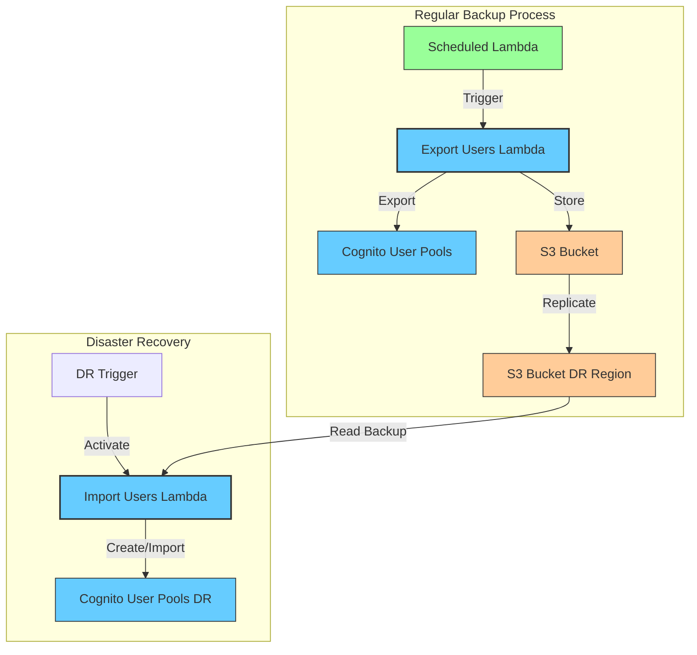
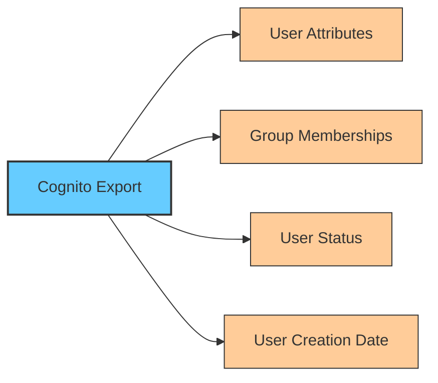
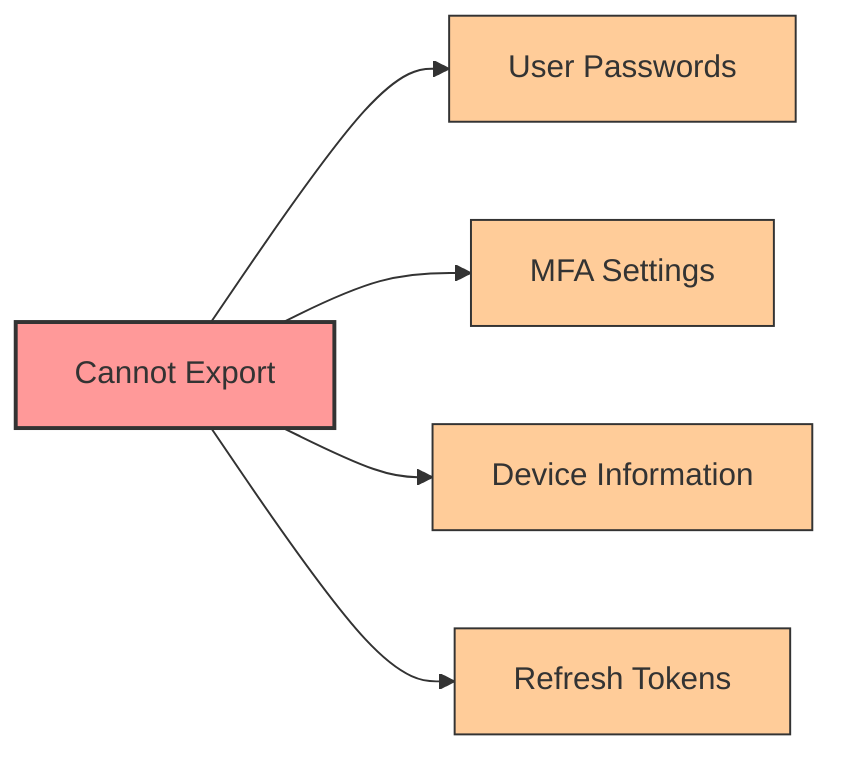
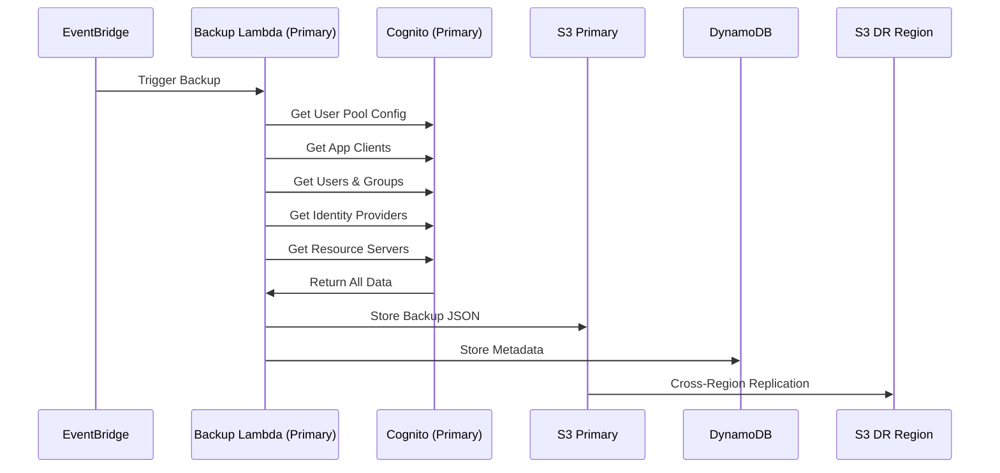
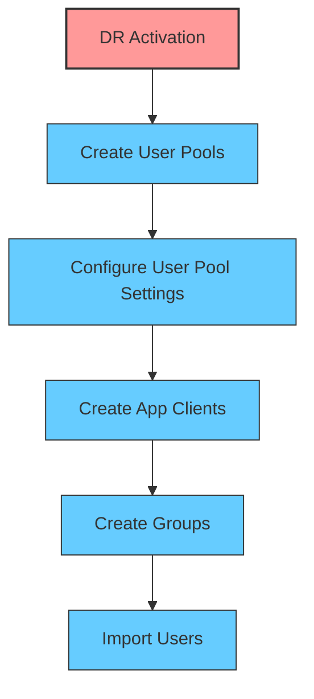
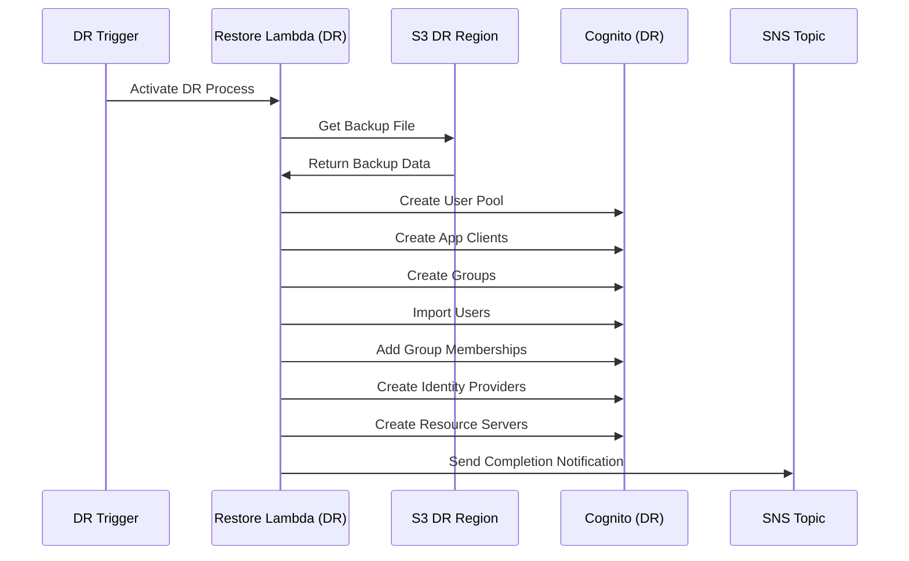
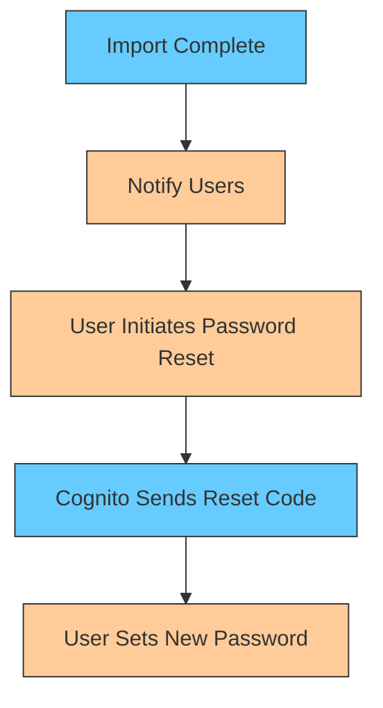
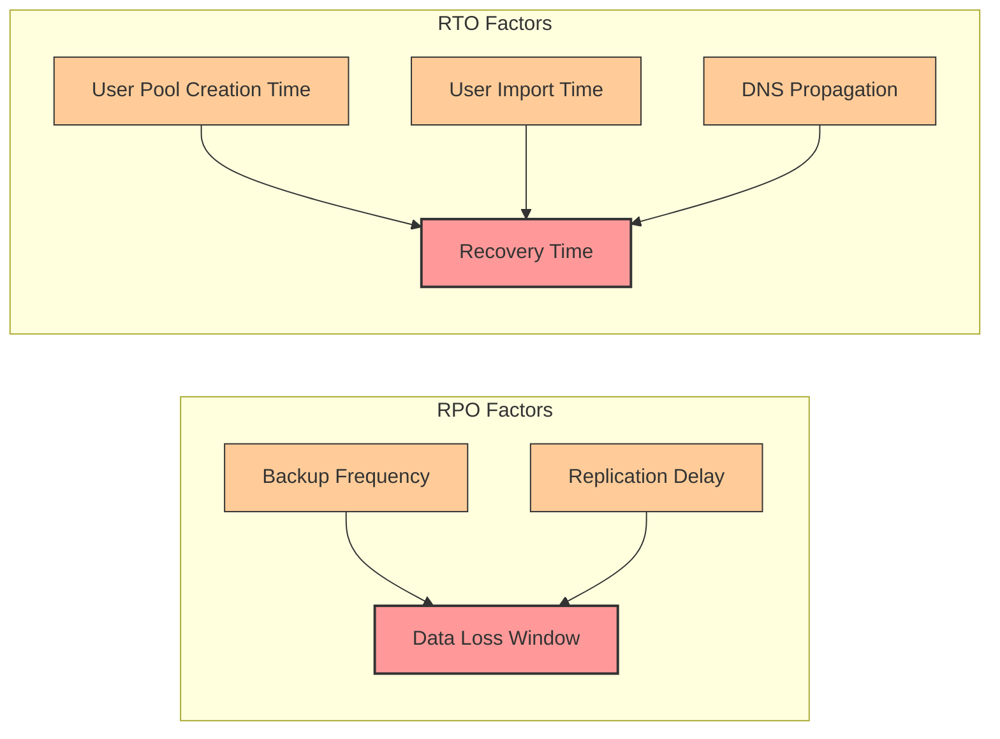
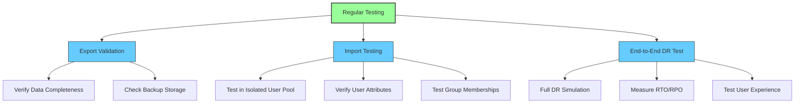

# Option 3: Cognito Backup and Restore Strategy

This document details the backup and restore approach for Amazon Cognito user pools as a disaster recovery strategy.

## Overview

The backup and restore strategy involves regularly exporting user data from Cognito user pools in the primary region and storing it in S3. In the event of a disaster, this data is used to recreate user pools and import users in the DR region.



## Required Components

1. **Export Lambda Function**: Exports user data from Cognito user pools
2. **S3 Buckets**: Store exported user data with cross-region replication
3. **Import Lambda Function**: Recreates user pools and imports users in DR region
4. **CloudWatch Events**: Schedules regular backups
5. **IAM Roles**: Provides necessary permissions for Lambda functions

## Export Process Details

### What Gets Exported



The export process captures:

1. **User Profiles**: All user attributes including standard and custom attributes
2. **Group Memberships**: User assignments to groups
3. **User Status**: Whether users are confirmed, unconfirmed, etc.
4. **Metadata**: Creation dates, last modified dates, etc.

### What Cannot Be Exported



Important limitations:

1. **Passwords**: User passwords cannot be exported
2. **MFA Settings**: MFA configurations and seeds cannot be exported
3. **Device Information**: Remembered devices are not exported
4. **Session Information**: Tokens and sessions are not exported

For detailed strategies to address these limitations, see [cognito_dr_limitations_solutions.md](./cognito_dr_limitations_solutions.md).

### Export Process Flow



## Import Process Details

### Preparation Steps



Before importing users:

1. Create user pools in DR region with identical configuration
2. Set up app clients with same settings as primary region
3. Create all required groups
4. Configure identity providers if used

### Import Process Flow



### User Password Reset Process



Since passwords cannot be exported/imported:

1. Users must reset their passwords after DR activation
2. Implement a notification system to inform users
3. Consider pre-creating temporary passwords for critical users

## Implementation Requirements

### Export Lambda Function Requirements

```json
{
  "runtime": "python3.11",
  "timeout": 900,
  "memory": 512,
  "permissions": [
    "cognito-idp:ListUserPools",
    "cognito-idp:ListUsers",
    "cognito-idp:AdminListGroupsForUser",
    "cognito-idp:ListGroups",
    "cognito-idp:ListUsersInGroup",
    "s3:PutObject"
  ],
  "environment": {
    "USER_POOL_IDS": "us-east-1_XXXXXXXXX,us-east-1_YYYYYYYYY",
    "BACKUP_BUCKET": "cognito-backup-bucket",
    "BACKUP_PREFIX": "cognito-backups/"
  },
  "schedule": "rate(1 hour)"
}
```

### Import Lambda Function Requirements

```json
{
  "runtime": "python3.11",
  "timeout": 900,
  "memory": 512,
  "permissions": [
    "cognito-idp:CreateUserPool",
    "cognito-idp:UpdateUserPool",
    "cognito-idp:CreateUserPoolClient",
    "cognito-idp:CreateGroup",
    "cognito-idp:AdminCreateUser",
    "cognito-idp:AdminAddUserToGroup",
    "s3:GetObject",
    "sns:Publish"
  ],
  "environment": {
    "SOURCE_BUCKET": "cognito-backup-bucket-dr",
    "USER_POOL_CONFIGS": "{\"customer\":{\"name\":\"CustomerUserPool\"},\"admin\":{\"name\":\"AdminUserPool\"}}",
    "SNS_TOPIC_ARN": "arn:aws:sns:us-west-2:<account-id>:cognito-dr-notifications"
  }
}
```

## Backup Storage Requirements

1. **S3 Bucket in Primary Region**:
   - Lifecycle policies to manage backup retention
   - Versioning enabled
   - Server-side encryption

2. **S3 Bucket in DR Region**:
   - Cross-region replication from primary bucket
   - Same security settings as primary

3. **Backup Format**:
   - JSON files containing user data
   - Separate files for each user pool
   - Timestamped for version tracking

## RTO/RPO Considerations


## Others

### EventBridge Rule for User Creation Trigger

To trigger the backup Lambda when a user is created via console:

```json
{
  "Name": "cognito-console-user-created-backup-trigger",
  "EventPattern": {
    "source": ["aws.cognito-idp"],
    "detail-type": ["AWS API Call via CloudTrail"],
    "detail": {
      "eventSource": ["cognito-idp.amazonaws.com"],
      "eventName": ["AdminCreateUser"]
    }
  },
  "State": "ENABLED",
  "Targets": [
    {
      "Id": "1",
      "Arn": "arn:aws:lambda:us-east-1:<account-id>:function:cognito-backup-export"
    }
  ]
}
```

**Note**: Console user creation uses `AdminCreateUser` API call. No additional filters needed.

### Sample Lambda Function for Cognito Backup

```python
import json
import boto3
import os
from datetime import datetime

def lambda_handler(event, context):
    try:
        cognito = boto3.client('cognito-idp')
        s3 = boto3.client('s3')
        dynamodb = boto3.resource('dynamodb')
        
        user_pool_ids = os.environ.get('USER_POOL_IDS', '').split(',')
        bucket = os.environ['BACKUP_BUCKET']
        table_name = os.environ['BACKUP_TABLE']
        
        all_backups = []
        
        for user_pool_id in user_pool_ids:
            if not user_pool_id.strip():
                continue
            
            user_pool_id = user_pool_id.strip()
            print(f"Starting backup for user pool: {user_pool_id}")
        
        # Get all users with pagination
        users = []
        paginator = cognito.get_paginator('list_users')
        for page in paginator.paginate(UserPoolId=user_pool_id):
            users.extend(page['Users'])
        
        # Get user pool configuration
        user_pool = cognito.describe_user_pool(UserPoolId=user_pool_id)['UserPool']
        
        # Get app clients
        app_clients = []
        client_paginator = cognito.get_paginator('list_user_pool_clients')
        for page in client_paginator.paginate(UserPoolId=user_pool_id):
            for client in page['UserPoolClients']:
                client_detail = cognito.describe_user_pool_client(
                    UserPoolId=user_pool_id,
                    ClientId=client['ClientId']
                )['UserPoolClient']
                app_clients.append(client_detail)
        
        # Get groups and group memberships
        groups = cognito.list_groups(UserPoolId=user_pool_id)['Groups']
        group_memberships = {}
        
        for group in groups:
            group_users = []
            group_paginator = cognito.get_paginator('list_users_in_group')
            for page in group_paginator.paginate(
                UserPoolId=user_pool_id, 
                GroupName=group['GroupName']
            ):
                group_users.extend([u['Username'] for u in page['Users']])
            group_memberships[group['GroupName']] = group_users
        
        # Get identity providers (optional)
        identity_providers = []
        try:
            idp_paginator = cognito.get_paginator('list_identity_providers')
            for page in idp_paginator.paginate(UserPoolId=user_pool_id):
                for idp in page['Providers']:
                    idp_detail = cognito.describe_identity_provider(
                        UserPoolId=user_pool_id,
                        ProviderName=idp['ProviderName']
                    )['IdentityProvider']
                    identity_providers.append(idp_detail)
            print(f"Backed up {len(identity_providers)} identity providers")
        except Exception as e:
            print(f"No identity providers found or error: {str(e)}")
        
        # Get resource servers (optional)
        resource_servers = []
        try:
            rs_paginator = cognito.get_paginator('list_resource_servers')
            for page in rs_paginator.paginate(UserPoolId=user_pool_id):
                resource_servers.extend(page['ResourceServers'])
            print(f"Backed up {len(resource_servers)} resource servers")
        except Exception as e:
            print(f"No resource servers found or error: {str(e)}")
        
            # Get user pool domain (optional)
            user_pool_domain = None
            try:
                domain_response = cognito.describe_user_pool_domain(Domain=user_pool_id)
                user_pool_domain = domain_response.get('DomainDescription')
                print(f"Backed up user pool domain")
            except Exception as e:
                print(f"No user pool domain found: {str(e)}")
            
            # Get UI customization (optional)
            ui_customization = None
            try:
                ui_response = cognito.get_ui_customization(UserPoolId=user_pool_id)
                ui_customization = ui_response.get('UICustomization')
                print(f"Backed up UI customization")
            except Exception as e:
                print(f"No UI customization found: {str(e)}")
        
            backup_data = {
                'timestamp': datetime.utcnow().isoformat(),
                'user_pool_id': user_pool_id,
                'user_pool_config': user_pool,
                'app_clients': app_clients,
                'users': users,
                'groups': groups,
                'group_memberships': group_memberships,
                'identity_providers': identity_providers,
                'resource_servers': resource_servers,
                'user_pool_domain': user_pool_domain,
                'ui_customization': ui_customization
            }
        
            # Validate backup data
            if not backup_data.get('users') and not backup_data.get('groups'):
                print(f"Warning: No users or groups found for {user_pool_id}")
            
            # Store in S3 with retry logic
            timestamp = datetime.utcnow()
            key = f"cognito-backup/{timestamp.strftime('%Y/%m/%d')}/{user_pool_id}-{timestamp.strftime('%H%M%S')}.json"
            
            for attempt in range(3):
                try:
                    s3.put_object(
                        Bucket=bucket, 
                        Key=key, 
                        Body=json.dumps(backup_data, default=str),
                        ServerSideEncryption='AES256'
                    )
                    break
                except Exception as e:
                    if attempt == 2:
                        raise e
                    print(f"S3 upload attempt {attempt + 1} failed, retrying...")
                    time.sleep(2 ** attempt)
        
            # Store metadata in DynamoDB
            table = dynamodb.Table(table_name)
            table.put_item(Item={
                'user_pool_id': user_pool_id,
                'backup_date': timestamp.isoformat(),
                's3_key': key,
                'user_count': len(users),
                'group_count': len(groups),
                'app_client_count': len(app_clients),
                'identity_provider_count': len(identity_providers),
                'resource_server_count': len(resource_servers)
            })
            
            all_backups.append({
                'user_pool_id': user_pool_id,
                's3_key': key,
                'user_count': len(users)
            })
            
        return {
            'statusCode': 200, 
            'body': json.dumps({
                'message': f'Successfully backed up {len(all_backups)} user pools',
                'backups': all_backups
            })
        }
        
    except Exception as e:
        print(f"Backup failed: {str(e)}")
        return {
            'statusCode': 500,
            'body': json.dumps({'error': str(e)})
        }
```

### DynamoDB Table Schema for Backup Metadata

**Purpose**: Track backup history, monitor backup success/failure, and locate S3 backup files for recovery.

```json
{
  "TableName": "cognito-backup-metadata",
  "KeySchema": [
    {"AttributeName": "user_pool_id", "KeyType": "HASH"},
    {"AttributeName": "backup_date", "KeyType": "RANGE"}
  ],
  "AttributeDefinitions": [
    {"AttributeName": "user_pool_id", "AttributeType": "S"},
    {"AttributeName": "backup_date", "AttributeType": "S"}
  ],
  "BillingMode": "PAY_PER_REQUEST",
  "PointInTimeRecoverySpecification": {
    "PointInTimeRecoveryEnabled": true
  },
  "SSESpecification": {
    "Enabled": true
  }
}
```

**Stored Attributes** (beyond key schema):
- `s3_key`: Location of backup file in S3
- `user_count`: Number of users backed up
- `group_count`: Number of groups backed up
- `app_client_count`: Number of app clients backed up
- `identity_provider_count`: Number of identity providers backed up
- `resource_server_count`: Number of resource servers backed up

### Sample Lambda Function for Cognito Restore (DR Region)

```python
import json
import boto3
import os
from datetime import datetime

def lambda_handler(event, context):
    try:
        cognito = boto3.client('cognito-idp')
        s3 = boto3.client('s3')
        sns = boto3.client('sns')
        
        source_bucket = os.environ['SOURCE_BUCKET']
        sns_topic = os.environ['SNS_TOPIC_ARN']
        
        # Get latest backup from S3
        s3_key = event.get('s3_key')  # Passed from trigger
        if not s3_key:
            raise Exception('No S3 key provided for restore')
        
        # Download backup data
        response = s3.get_object(Bucket=source_bucket, Key=s3_key)
        backup_data = json.loads(response['Body'].read())
        
        # Create user pool with configuration
        user_pool_config = backup_data['user_pool_config'].copy()
        # Remove read-only attributes
        for attr in ['Id', 'Arn', 'CreationDate', 'LastModifiedDate', 'Status']:
            user_pool_config.pop(attr, None)
        
        new_pool = cognito.create_user_pool(**user_pool_config)
        new_pool_id = new_pool['UserPool']['Id']
        
        # Create app clients
        for client in backup_data['app_clients']:
            client_config = client.copy()
            # Remove read-only attributes
            for attr in ['ClientId', 'UserPoolId', 'CreationDate', 'LastModifiedDate']:
                client_config.pop(attr, None)
            cognito.create_user_pool_client(
                UserPoolId=new_pool_id,
                **client_config
            )
        
        # Create groups
        for group in backup_data['groups']:
            group_config = group.copy()
            group_config.pop('UserPoolId', None)
            cognito.create_group(
                UserPoolId=new_pool_id,
                **group_config
            )
        
        # Import users
        for user in backup_data['users']:
            user_attrs = []
            for attr in user.get('Attributes', []):
                user_attrs.append({
                    'Name': attr['Name'],
                    'Value': attr['Value']
                })
            
            cognito.admin_create_user(
                UserPoolId=new_pool_id,
                Username=user['Username'],
                UserAttributes=user_attrs,
                MessageAction='SUPPRESS',
                UserStatus='CONFIRMED'
            )
        
        # Add users to groups
        for group_name, usernames in backup_data['group_memberships'].items():
            for username in usernames:
                cognito.admin_add_user_to_group(
                    UserPoolId=new_pool_id,
                    Username=username,
                    GroupName=group_name
                )
        
        # Create identity providers
        for idp in backup_data.get('identity_providers', []):
            idp_config = idp.copy()
            # Remove read-only attributes
            for attr in ['UserPoolId', 'CreationDate', 'LastModifiedDate']:
                idp_config.pop(attr, None)
            cognito.create_identity_provider(
                UserPoolId=new_pool_id,
                **idp_config
            )
        
        # Create resource servers
        for rs in backup_data.get('resource_servers', []):
            rs_config = rs.copy()
            rs_config.pop('UserPoolId', None)
            cognito.create_resource_server(
                UserPoolId=new_pool_id,
                **rs_config
            )
        
        # Restore user pool domain (optional)
        if backup_data.get('user_pool_domain'):
            try:
                domain_config = backup_data['user_pool_domain'].copy()
                for attr in ['Domain', 'AWSAccountId', 'CloudFrontDistribution', 'Version', 'Status', 'CreationDate', 'LastModifiedDate']:
                    domain_config.pop(attr, None)
                cognito.create_user_pool_domain(
                    Domain=f"{new_pool_id}-dr",
                    UserPoolId=new_pool_id,
                    **domain_config
                )
            except Exception as e:
                print(f"Failed to restore domain: {str(e)}")
        
        # Restore UI customization (optional)
        if backup_data.get('ui_customization'):
            try:
                ui_config = backup_data['ui_customization'].copy()
                for attr in ['UserPoolId', 'ClientId', 'CreationDate', 'LastModifiedDate']:
                    ui_config.pop(attr, None)
                cognito.set_ui_customization(
                    UserPoolId=new_pool_id,
                    **ui_config
                )
            except Exception as e:
                print(f"Failed to restore UI customization: {str(e)}")
        
        # Send completion notification
        sns.publish(
            TopicArn=sns_topic,
            Message=json.dumps({
                'status': 'SUCCESS',
                'new_user_pool_id': new_pool_id,
                'users_restored': len(backup_data['users']),
                'groups_restored': len(backup_data['groups']),
                'app_clients_restored': len(backup_data['app_clients']),
                'identity_providers_restored': len(backup_data.get('identity_providers', [])),
                'resource_servers_restored': len(backup_data.get('resource_servers', []))
            }),
            Subject='Cognito DR Restore Completed'
        )
        
        return {
            'statusCode': 200,
            'body': json.dumps({
                'message': 'Restore completed successfully',
                'new_user_pool_id': new_pool_id
            })
        }
        
    except Exception as e:
        print(f"Restore failed: {str(e)}")
        return {
            'statusCode': 500,
            'body': json.dumps({'error': str(e)})
        }
```

## Manual Configuration Required After Restore

### Lambda Triggers
**Cannot be automated** - Must be manually configured:

```bash
# Pre-authentication trigger
aws cognito-idp update-user-pool \
  --user-pool-id <NEW_POOL_ID> \
  --lambda-config PreAuthentication=arn:aws:lambda:region:account:function:pre-auth

# Post-authentication trigger
aws cognito-idp update-user-pool \
  --user-pool-id <NEW_POOL_ID> \
  --lambda-config PostAuthentication=arn:aws:lambda:region:account:function:post-auth
```

### Email/SMS Configuration
**Requires manual setup** due to security restrictions:

```bash
# Configure SES for email
aws cognito-idp update-user-pool \
  --user-pool-id <NEW_POOL_ID> \
  --email-configuration SourceArn=arn:aws:ses:region:account:identity/domain.com

# Configure SNS for SMS
aws cognito-idp update-user-pool \
  --user-pool-id <NEW_POOL_ID> \
  --sms-configuration SnsCallerArn=arn:aws:iam::account:role/service-role/CognitoSNSRole
```

### Application Configuration Updates
**Update application configs** with new user pool ID:

1. **Environment Variables**: Update `COGNITO_USER_POOL_ID`
2. **Load Balancer**: Update health checks
3. **DNS Records**: Update Route 53 records
4. **CDN**: Update CloudFront origins

### Post-Restore Checklist

**Immediate Actions:**
- [ ] Configure Lambda triggers (pre/post auth, token generation)
- [ ] Set up SES/SNS integration for email/SMS
- [ ] Update application configurations with new pool ID
- [ ] Update DNS records and load balancer configurations

**Testing & Validation:**
- [ ] Test user authentication flow
- [ ] Verify identity provider integrations
- [ ] Test password reset functionality
- [ ] Validate group memberships and permissions

**User Communication:**
- [ ] Send password reset notifications to users
- [ ] Notify users about MFA reconfiguration requirement
- [ ] Update user documentation with new endpoints

**Monitoring & Operations:**
- [ ] Update monitoring and alerting configurations
- [ ] Verify backup processes are working in DR region
- [ ] Test rollback procedures

**Required IAM Permissions for Restore Lambda:**
```json
{
  "Version": "2012-10-17",
  "Statement": [
    {
      "Effect": "Allow",
      "Action": [
        "cognito-idp:CreateUserPool",
        "cognito-idp:CreateUserPoolClient",
        "cognito-idp:CreateGroup",
        "cognito-idp:AdminCreateUser",
        "cognito-idp:AdminAddUserToGroup",
        "cognito-idp:CreateIdentityProvider",
        "cognito-idp:CreateResourceServer",
        "cognito-idp:CreateUserPoolDomain",
        "cognito-idp:SetUICustomization"
      ],
      "Resource": "arn:aws:cognito-idp:*:*:userpool/*"
    },
    {
      "Effect": "Allow",
      "Action": [
        "s3:GetObject"
      ],
      "Resource": "arn:aws:s3:::cognito-backup-bucket-dr/*"
    },
    {
      "Effect": "Allow",
      "Action": [
        "sns:Publish"
      ],
      "Resource": "arn:aws:sns:*:*:cognito-dr-notifications"
    }
  ]
}
```

**Required IAM Permissions for Backup Lambda:**
```json
{
  "Version": "2012-10-17",
  "Statement": [
    {
      "Effect": "Allow",
      "Action": [
        "cognito-idp:DescribeUserPool",
        "cognito-idp:ListUserPoolClients",
        "cognito-idp:DescribeUserPoolClient",
        "cognito-idp:ListUsers",
        "cognito-idp:ListGroups",
        "cognito-idp:ListUsersInGroup",
        "cognito-idp:ListIdentityProviders",
        "cognito-idp:DescribeIdentityProvider",
        "cognito-idp:ListResourceServers"
      ],
      "Resource": "arn:aws:cognito-idp:*:*:userpool/*"
    },
    {
      "Effect": "Allow",
      "Action": [
        "s3:PutObject"
      ],
      "Resource": "arn:aws:s3:::cognito-backup-bucket/*"
    },
    {
      "Effect": "Allow",
      "Action": [
        "dynamodb:PutItem"
      ],
      "Resource": "arn:aws:dynamodb:*:*:table/cognito-backup-metadata"
    }
  ]
}
``` 


### RPO (Recovery Point Objective)

- Determined by backup frequency (e.g., hourly backups = up to 1 hour of data loss)
- Affected by S3 cross-region replication time (typically minutes)
- Typical achievable RPO: 1-2 hours

### RTO (Recovery Time Objective)

- User pool creation: ~5 minutes
- User import time: Depends on user count (approximately 1000 users per minute)
- App client and group creation: ~5-10 minutes
- DNS propagation: Up to 60 minutes
- Typical achievable RTO: 1-2 hours for small user pools, 2-4 hours for large user pools

## Limitations and Challenges

1. **Password Reset Requirement**: Users need to reset passwords after DR activation
2. **MFA Reconfiguration**: Users need to reconfigure MFA
3. **Import Limits**: Cognito has limits on bulk user imports
4. **Manual Configuration**: Some user pool settings must be manually configured
5. **No Active Sessions**: All users must re-authenticate after failover

## Testing Recommendations



1. **Regular Export Testing**: Verify backups are complete and accessible
2. **Import Testing**: Periodically test import process in test user pools
3. **Full DR Testing**: Conduct end-to-end DR tests quarterly
4. **User Experience Testing**: Test password reset flow and communication

## Engineer Notes

### Username Handling in DR Restore

**Important**: The DR restore process preserves original usernames exactly as they were in the primary region:

- **UUID username + email attribute**: `username=a1b2c3d4-e5f6-7890-abcd-ef1234567890` → Uses `a1b2c3d4-e5f6-7890-abcd-ef1234567890`
- **Email username + email attribute**: `username=user@example.com` → Uses `user@example.com`c@gmail.com` → Uses `cigbokwec@gmail.com`

**Technical Implementation**:
- DR user pool removes `UsernameAttributes: ['email']` restriction
- Removes email from `AliasAttributes` to prevent email-only validation
- Always uses `user['Username']` from backup without modification
- Maintains identical user experience across primary and DR regions

**Rationale**: Preserving original usernames ensures users can authenticate with the same credentials they used before DR activation, minimizing user impact during disaster recovery scenarios.

## Cost Considerations

1. **Lambda Execution**: Costs for regular export and DR import functions
2. **S3 Storage**: Storage costs for user data backups
3. **S3 Cross-Region Replication**: Data transfer costs
4. **Cognito User Pools**: Costs for DR region user pools during testing
5. **SNS Notifications**: Costs for user notifications during DR
