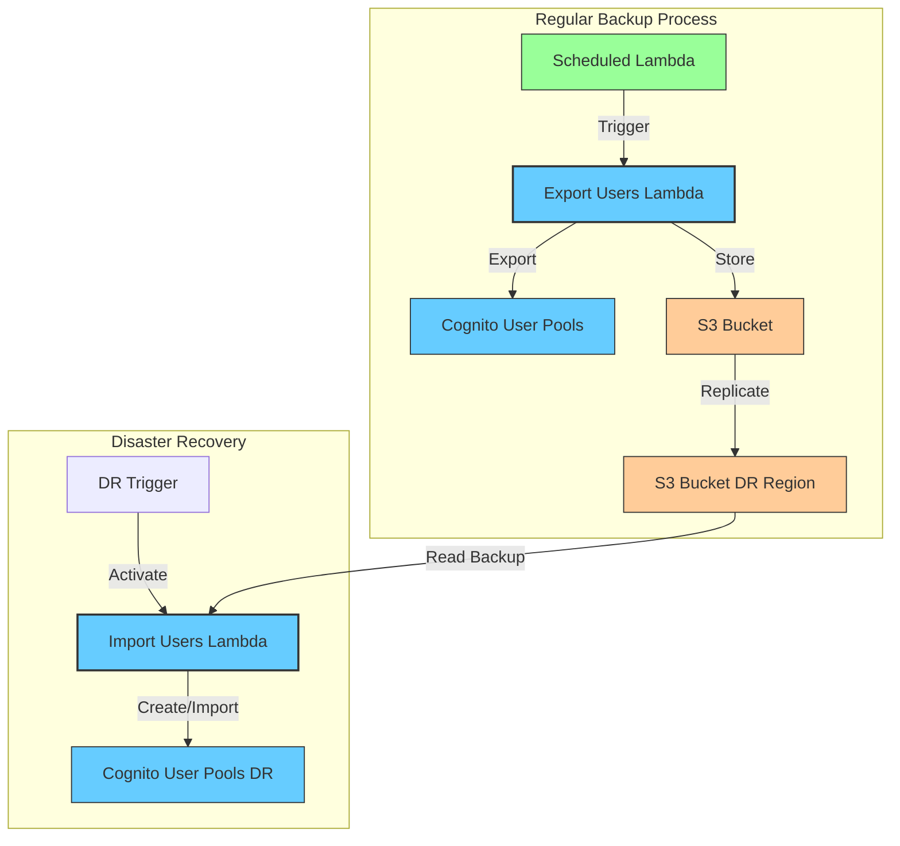
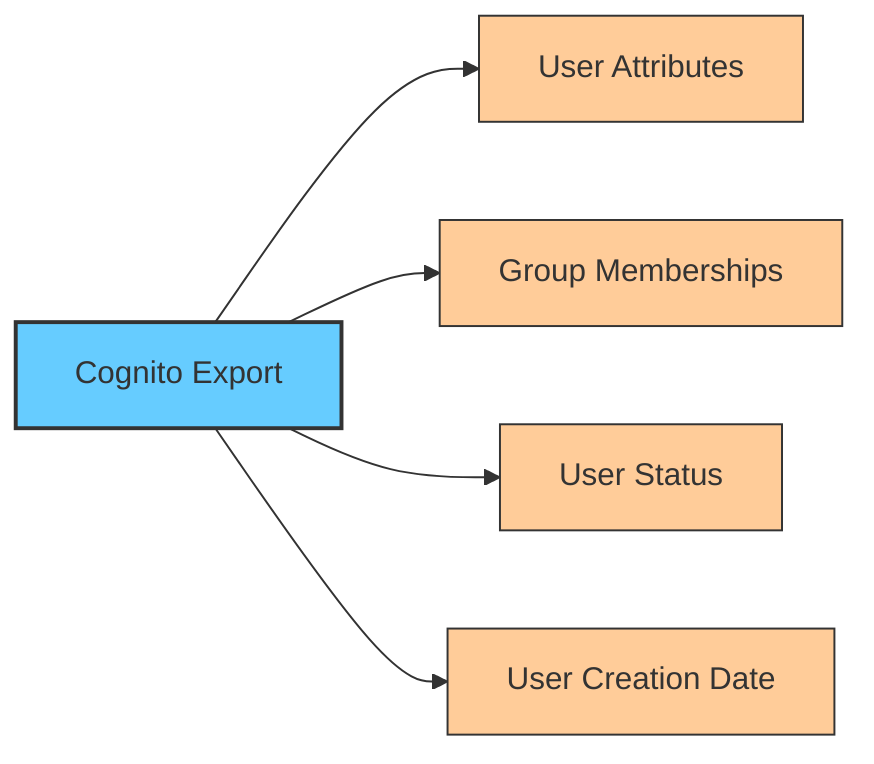
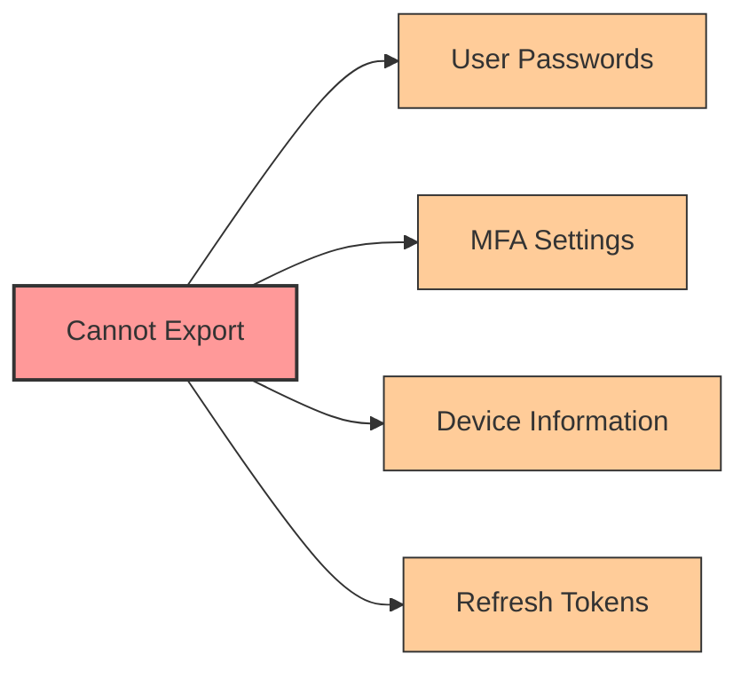
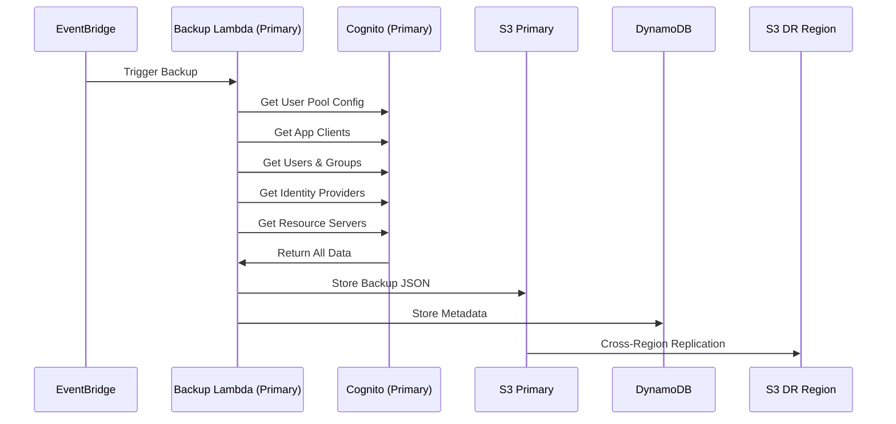
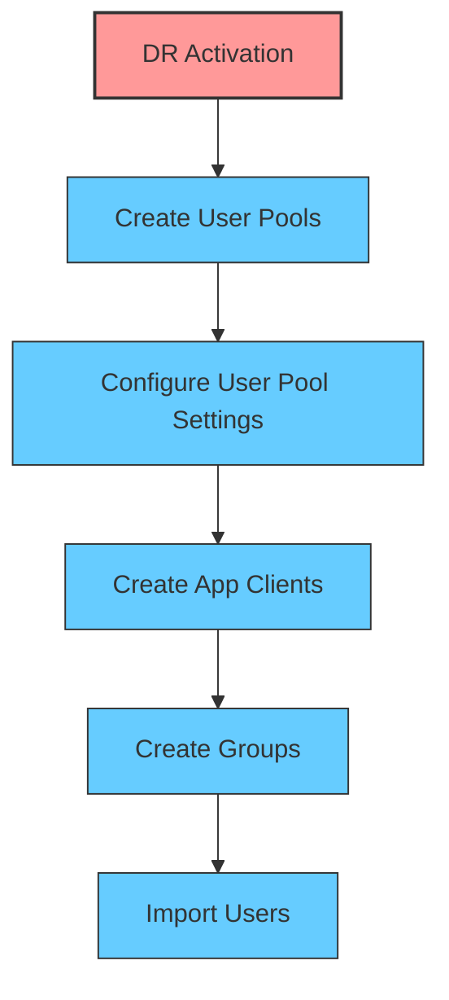
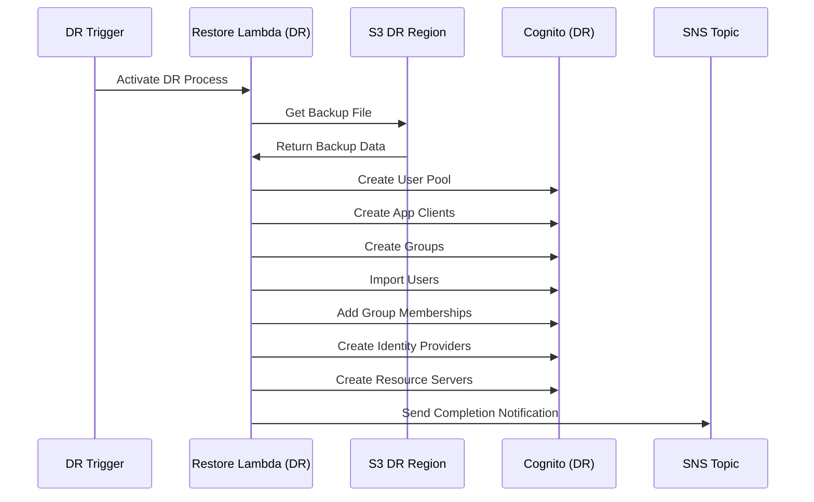
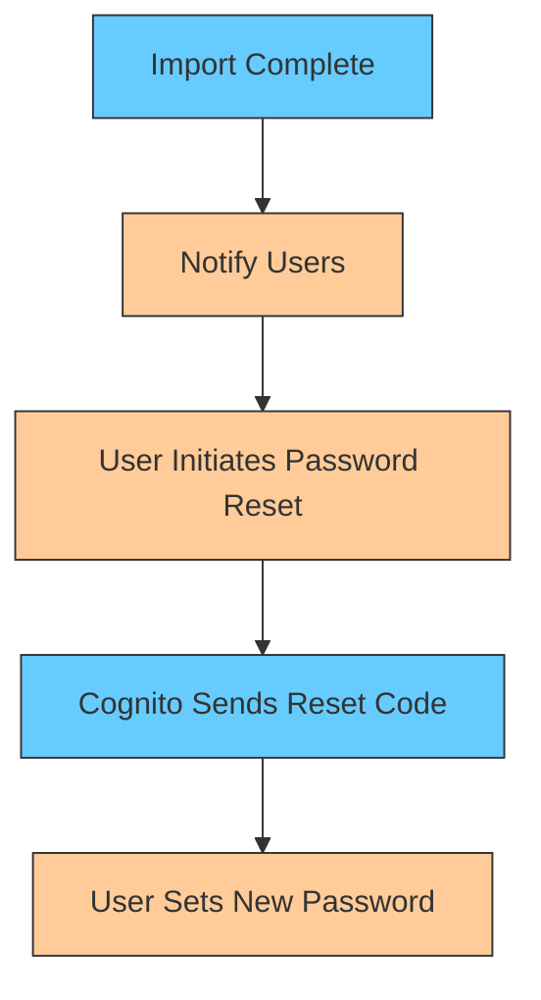
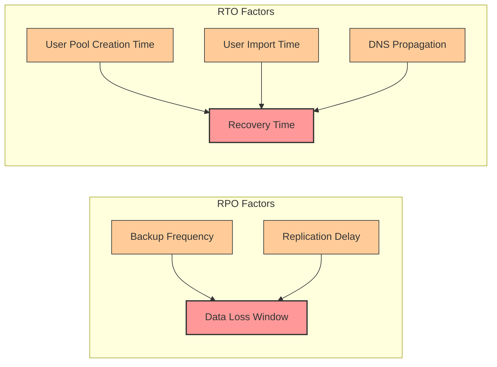
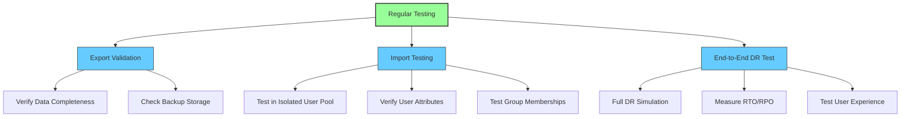

# Cognito Backup and Restore Strategy

This document details the backup and restore approach for Amazon Cognito user pools as a disaster recovery strategy.

## Overview

The backup and restore strategy involves regularly exporting user data from Cognito user pools in the primary region and storing it in S3. In the event of a disaster, this data is used to recreate user pools and import users in the DR region.



## Required Components

1. **Export Lambda Function**: Exports user data from Cognito user pools
2. **S3 Buckets**: Store exported user data with cross-region replication
3. **Import Lambda Function**: Recreates user pools and imports users in DR region
4. **CloudWatch Events**: Schedules regular backups
5. **IAM Roles**: Provides necessary permissions for Lambda functions

## Export Process Details

### What Gets Exported



The export process captures:

1. **User Profiles**: All user attributes including standard and custom attributes
2. **Group Memberships**: User assignments to groups
3. **User Status**: Whether users are confirmed, unconfirmed, etc.
4. **Metadata**: Creation dates, last modified dates, etc.

### What Cannot Be Exported



Important limitations:

1. **Passwords**: User passwords cannot be exported
2. **MFA Settings**: MFA configurations and seeds cannot be exported
3. **Device Information**: Remembered devices are not exported
4. **Session Information**: Tokens and sessions are not exported


### Export Process Flow



## Import Process Details

### Preparation Steps



Before importing users:

1. Create user pools in DR region with identical configuration
2. Set up app clients with same settings as primary region
3. Create all required groups
4. Configure identity providers if used

### Import Process Flow



### User Password Reset Process



Since passwords cannot be exported/imported:

1. Users must reset their passwords after DR activation
2. Implement a notification system to inform users
3. Consider pre-creating temporary passwords for critical users


## Backup Storage Requirements

1. **S3 Bucket in Primary Region**:
   - Lifecycle policies to manage backup retention
   - Versioning enabled
   - Server-side encryption

2. **S3 Bucket in DR Region**:
   - Cross-region replication from primary bucket
   - Same security settings as primary

3. **Backup Format**:
   - JSON files containing user data
   - Separate files for each user pool
   - Timestamped for version tracking

## RTO/RPO Considerations




## Disaster Recovery Restore Strategy

### Preservation-First Approach

The restore process is designed to **preserve original values as much as possible** to minimize manual configuration changes and maintain application compatibility.

### What Gets Preserved (No Manual Changes Required)

**✅ Fully Preserved:**
- **User Pool Name** - Exact original name (e.g., `kinesis-user-pool`)
- **App Client Name** - Original client names preserved
- **Usernames** - Exact original usernames (UUID or email format)
- **User Attributes** - All custom and standard attributes (email, name, etc.)
- **User Status** - CONFIRMED/UNCONFIRMED status maintained
- **Group Names** - All group names and descriptions
- **Policies & Settings** - Password policies, MFA configuration, etc.
- **Domain Names** - Original domain names if available
- **Username Configuration** - Only modified if absolutely necessary

### What Cannot Be Preserved (AWS API Limitations)

**❌ Auto-Generated by AWS:**
- **User Pool ID** - `us-east-1_Abc123XyZ` → `us-west-2_Def456UvW` (region-specific)
- **App Client ID** - `7h8j9k2m4n6p8q1r3s5t7u9v` → `NEW_CLIENT_ID`
- **Client Secret** - `a1b2c3d4e5f6...` → `NEW_SECRET` (security requirement)
- **User `sub` ID** - `a1b2c3d4-e5f6-7890-abcd-ef1234567890` → `NEW_SUB`

### Why Some Values Are Preserved vs Auto-Generated

**✅ User Pool Name (`kinesis-user-pool`) - PRESERVED:**
```python
# AWS API accepts custom names
cognito.create_user_pool(
    PoolName="kinesis-user-pool"  # ✅ Custom name allowed
)
```

**❌ User Pool ID (`us-east-1_Abc123XyZ`) - AUTO-GENERATED:**
```python
# AWS API does NOT accept custom IDs
cognito.create_user_pool(
    Id="us-east-1_Abc123XyZ",     # ❌ Parameter not supported
    PoolName="kinesis-user-pool"   # ✅ Only name is accepted
)
# AWS automatically generates: us-west-2_Def456UvW
```

**❌ App Client ID (`7h8j9k2m4n6p8q1r3s5t7u9v`) - AUTO-GENERATED:**
```python
# AWS API does NOT accept custom client IDs
cognito.create_user_pool_client(
    ClientId="7h8j9k2m4n6p8q1r3s5t7u9v",  # ❌ Parameter not supported
    ClientName="kinesis-app-client"        # ✅ Only name is accepted
)
# AWS automatically generates new client ID
```

**❌ Client Secret (`a1b2c3d4e5f6...`) - AUTO-GENERATED:**
```python
# AWS API does NOT accept custom secrets (security policy)
cognito.create_user_pool_client(
    ClientSecret="a1b2c3d4e5f6...",  # ❌ Parameter not supported
    GenerateSecret=True              # ✅ AWS generates new secret
)
```

**❌ User `sub` ID (`a1b2c3d4-e5f6-7890-abcd-ef1234567890`) - AUTO-GENERATED:**
```python
# AWS API does NOT accept custom sub IDs (security/uniqueness)
cognito.admin_create_user(
    Username="user@example.com",
    UserAttributes=[
        {'Name': 'sub', 'Value': 'a1b2c3d4-e5f6-7890-abcd-ef1234567890'}  # ❌ Filtered out
    ]
)
# AWS automatically generates new unique sub ID
```


### Smart Restore Logic

**Intelligent Configuration Handling:**
- **Username Attributes**: Only removes email restriction if backup contains UUID usernames
- **Domain Preservation**: Uses original domain name when available in backup
- **Minimal Modifications**: Changes only what's absolutely required for restore to work
- **Error Prevention**: Filters system attributes that cause API failures

### System Attributes Filtered During Restore

**Filtered Out (Cannot be set during user creation):**
- `sub`, `email_verified`, `phone_number_verified`
- `cognito:username`, `cognito:mfa_enabled`, `identities`
- `user_create_date`, `user_last_modified_date`

**Why Filtering is Necessary:**
- These are **system-generated** and **non-mutable**
- AWS auto-creates them during user pool/user creation
- Attempting to set them causes API validation errors
- **No functionality is lost** - Cognito recreates them automatically

### Manual Configuration Required After Restore

**Minimal Manual Tasks (Only 3 Values):**
1. Update application config with new **User Pool ID**
2. Update application config with new **App Client ID**
3. Update application config with new **Client Secret**

**User Impact:**
- Users must **re-authenticate** (new `sub` values)
- **Passwords must be reset** (cannot be migrated)
- **MFA must be reconfigured** (security requirement)


### DynamoDB Table Schema for Backup Metadata

**Purpose**: Track backup history, monitor backup success/failure, and locate S3 backup files for recovery.

```json
{
  "TableName": "cognito-backup-metadata",
  "KeySchema": [
    {"AttributeName": "user_pool_id", "KeyType": "HASH"},
    {"AttributeName": "backup_date", "KeyType": "RANGE"}
  ],
  "AttributeDefinitions": [
    {"AttributeName": "user_pool_id", "AttributeType": "S"},
    {"AttributeName": "backup_date", "AttributeType": "S"}
  ],
  "BillingMode": "PAY_PER_REQUEST",
  "PointInTimeRecoverySpecification": {
    "PointInTimeRecoveryEnabled": true
  },
  "SSESpecification": {
    "Enabled": true
  }
}
```

**Stored Attributes** (beyond key schema):
- `s3_key`: Location of backup file in S3
- `user_count`: Number of users backed up
- `group_count`: Number of groups backed up
- `app_client_count`: Number of app clients backed up
- `identity_provider_count`: Number of identity providers backed up
- `resource_server_count`: Number of resource servers backed up


## Sample SNS Email Notification

**Subject:** Cognito DR Restore Completed

**Message Body:**
```json
{
  "status": "SUCCESS",
  "new_user_pool_id": "us-west-2_YYYYYYYYY",
  "users_restored": 1247,
  "groups_restored": 5,
  "app_clients_restored": 3,
  "identity_providers_restored": 2,
  "resource_servers_restored": 1,
  "restore_time": "2024-01-15T14:30:22Z",
  "backup_source": "cognito-backup/us-east-1_XXXXXXXXX/2024-01-15-14-00-00.json"
}
```

**Email Template:**
```
Subject: [ALERT] Cognito DR Restore Completed Successfully

Cognito Disaster Recovery restore has completed successfully.

Restore Summary:
- Status: SUCCESS
- New User Pool ID: us-west-2_YYYYYYYYY
- Users Restored: 1,247
- Groups Restored: 5
- App Clients Restored: 3
- Identity Providers Restored: 2
- Resource Servers Restored: 1
- Restore Time: 2024-01-15 14:30:22 UTC

Next Steps Required:
1. Update application configurations with new User Pool ID
2. Update Okta/IDP redirect URIs
3. Update DNS records
4. Test authentication flows
5. Notify users about password reset requirement

This is an automated notification from AWS Lambda.


## What Gets Backed Up vs Manual Configuration

### ✅ Automatically Backed Up and Restored

**Core User Pool Configuration:**
- User pool settings (policies, MFA, verification)
- Schema attributes (standard and custom)
- Username configuration and alias attributes
- Account recovery settings
- Admin create user configuration

**Users and Access Control:**
- All users with attributes (excluding system attributes)
- User status (CONFIRMED, FORCE_CHANGE_PASSWORD, etc.)
- Groups with descriptions and precedence
- Group memberships
- App clients with all settings (new secrets generated)

**Advanced Security Features:**
- **Domain configuration** - Cognito hosted UI domains
- **Threat protection settings:**
  - Enforcement mode (AUDIT/ENFORCED)
  - Compromised credentials detection and response
  - Adaptive authentication (account takeover protection)
  - Risk response actions (Low/Medium/High risk)
  - **IP address exceptions** (Always-allow and Always-block lists)
- UI customization (if domain exists)

**Federation and APIs:**
- Identity providers (SAML, OIDC)
- Resource servers and scopes

### ❌ Manual Configuration Required

**Infrastructure Integrations:**
- **WAF associations** - Environment-specific, must be manually configured
- **Export user activity logs** - CloudWatch integration, manual setup required
- **Lambda triggers** - Cross-region compatibility issues, manual configuration needed
- **Email/SMS providers** - SES/SNS integration, security restrictions

**Environment-Specific Settings:**
- Custom domain certificates (ACM)
- DNS records and Route 53 configurations
- Load balancer and CDN settings
- Monitoring and alerting configurations


### Post-Restore Checklist

**Immediate Actions:**
- [ ] Configure Lambda triggers (pre/post auth, token generation)
- [ ] Set up SES/SNS integration for email/SMS
- [ ] Update application configurations with new pool ID
- [ ] Update DNS records and load balancer configurations

**Testing & Validation:**
- [ ] Test user authentication flow
- [ ] Verify identity provider integrations
- [ ] Test password reset functionality
- [ ] Validate group memberships and permissions

**User Communication:**
- [ ] Send password reset notifications to users
- [ ] Notify users about MFA reconfiguration requirement
- [ ] Update user documentation with new endpoints

**Monitoring & Operations:**
- [ ] Update monitoring and alerting configurations
- [ ] Verify backup processes are working in DR region
- [ ] Test rollback procedures


### RPO (Recovery Point Objective)

- Determined by backup frequency (e.g., hourly backups = up to 1 hour of data loss)
- Affected by S3 cross-region replication time (typically minutes)
- Typical achievable RPO: 1-2 hours

### RTO (Recovery Time Objective)

- User pool creation: ~5 minutes
- User import time: Depends on user count (approximately 1000 users per minute)
- App client and group creation: ~5-10 minutes
- DNS propagation: Up to 60 minutes
- Typical achievable RTO: 1-2 hours for small user pools, 2-4 hours for large user pools

## Limitations and Challenges

1. **Password Reset Requirement**: Users need to reset passwords after DR activation
2. **MFA Reconfiguration**: Users need to reconfigure MFA
3. **Import Limits**: Cognito has limits on bulk user imports
4. **Manual Configuration**: Some user pool settings must be manually configured
5. **No Active Sessions**: All users must re-authenticate after failover

## Testing Recommendations



1. **Regular Export Testing**: Verify backups are complete and accessible
2. **Import Testing**: Periodically test import process in test user pools
3. **Full DR Testing**: Conduct end-to-end DR tests quarterly
4. **User Experience Testing**: Test password reset flow and communication

## Engineer Notes

### Username Handling in DR Restore

**Important**: The DR restore process preserves original usernames exactly as they were in the primary region:

- **UUID username + email attribute**: `username=a1b2c3d4-e5f6-7890-abcd-ef1234567890` → Uses `a1b2c3d4-e5f6-7890-abcd-ef1234567890`
- **Email username + email attribute**: `username=<email>` → Uses `<email>`

**Technical Implementation**:
- DR user pool removes `UsernameAttributes: ['email']` restriction
- Removes email from `AliasAttributes` to prevent email-only validation
- Always uses `user['Username']` from backup without modification
- Maintains identical user experience across primary and DR regions

**Rationale**: Preserving original usernames ensures users can authenticate with the same credentials they used before DR activation, minimizing user impact during disaster recovery scenarios.

### Manual Updates Required After DR Restore

#### Identity Provider (IDP) and Application Configuration Updates

After DR restore, manual updates are required for external IDPs and applications:

**1. Okta Configuration Updates**

**Required Changes:**
- **Redirect URIs**: Update to DR region Cognito endpoints
- **Audience URI**: Update to new user pool ID
- **Initiate Login URI**: Update to new Cognito domain

**Example:**
```
Primary: https://cognito-idp.us-east-1.amazonaws.com/us-east-1_XXXXXXXXX/saml2/idpresponse
DR: https://cognito-idp.us-west-2.amazonaws.com/us-west-2_YYYYYYYYY/saml2/idpresponse
```

**2. Amplify Application Updates**

**aws-exports.js Configuration:**
```javascript
// Update these values after DR restore
const awsmobile = {
    "aws_user_pools_id": "us-west-2_YYYYYYYYY", // New DR pool ID
    "aws_user_pools_web_client_id": "new_client_id", // New client ID
    "aws_cognito_region": "us-west-2", // DR region
    "aws_user_pools_domain": "auth-dr.example.com" // New domain
};
```

**3. Web Application Updates**

**Environment Variables:**
```bash
# Update application environment
COGNITO_USER_POOL_ID=us-west-2_YYYYYYYYY
COGNITO_CLIENT_ID=new_client_id
COGNITO_CLIENT_SECRET=new_client_secret
AWS_REGION=us-west-2
COGNITO_DOMAIN=auth-dr.example.com
```

**4. Mobile Application Updates**

**iOS (amplifyconfiguration.json):**
```json
{
    "auth": {
        "plugins": {
            "awsCognitoAuthPlugin": {
                "UserPool": {
                    "Default": {
                        "PoolId": "us-west-2_YYYYYYYYY",
                        "AppClientId": "new_client_id",
                        "Region": "us-west-2"
                    }
                }
            }
        }
    }
}
```

**Android (amplifyconfiguration.json):**
```json
{
    "auth": {
        "plugins": {
            "awsCognitoAuthPlugin": {
                "CognitoUserPool": {
                    "Default": {
                        "PoolId": "us-west-2_YYYYYYYYY",
                        "AppClientId": "new_client_id",
                        "Region": "us-west-2"
                    }
                }
            }
        }
    }
}
```

**5. Manual Update Checklist**

**Critical Updates (RTO Impact):**
- [ ] Update Okta/SAML redirect URIs
- [ ] Update Amplify aws-exports.js
- [ ] Update web app environment variables
- [ ] Update mobile app configuration files
- [ ] Update DNS records
- [ ] Deploy updated configurations

**Post-Recovery:**
- [ ] Update CI/CD pipelines
- [ ] Update documentation
- [ ] Test all authentication flows
- [ ] Update monitoring configurations


## Cost Considerations

1. **Lambda Execution**: Costs for regular export and DR import functions
2. **S3 Storage**: Storage costs for user data backups
3. **S3 Cross-Region Replication**: Data transfer costs
4. **Cognito User Pools**: Costs for DR region user pools during testing
5. **SNS Notifications**: Costs for user notifications during DR
