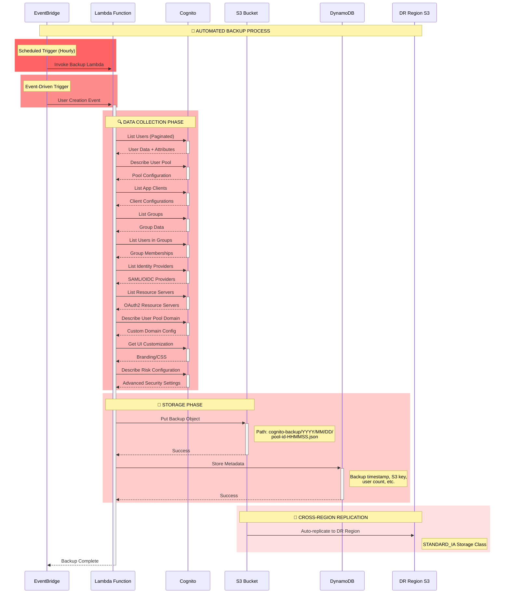

# Cognito Primary Backup System

## ⚠️ Prerequisites
> **🚨 IMPORTANT**: Run the DR YAML file first to get the ARN of the DR bucket which the backup needs for S3 replication (S3 destination needs to exist).


**Note**: The cognito backup lambda can be manually triggered without any parameters.

## Overview
This document outlines the automated backup system for Amazon Cognito User Pools, including what is backed up automatically vs. manually, and the complete flow to S3 storage.

## 🔄 Backup Flow Sequence Diagram



## 📊 What Gets Backed Up

### 🟢 Automatically Backed Up Components

| Component | Details | Frequency |
|-----------|---------|-----------|
| **User Data** | All users, attributes, status | Hourly + Event-driven |
| **User Pool Configuration** | Policies, MFA, password rules | Hourly + Event-driven |
| **App Clients** | Client IDs, settings, OAuth flows | Hourly + Event-driven |
| **Groups** | Group definitions and memberships | Hourly + Event-driven |
| **Identity Providers** | SAML/OIDC provider configs | Hourly + Event-driven |
| **Resource Servers** | OAuth2 resource server definitions | Hourly + Event-driven |
| **Custom Domains** | Domain configurations | Hourly + Event-driven |
| **UI Customization** | Branding, CSS, logos | Hourly + Event-driven |
| **Risk Configuration** | Advanced security, threat protection | Hourly + Event-driven |

### 🔴 Manual Configuration Required

| Component | Reason | Action Required |
|-----------|--------|-----------------|
| **WAF Configuration** | Complex rule dependencies | Manual documentation |
| **CloudTrail Integration** | Service-level configuration | Manual setup in DR |
| **Lambda Triggers** | Function dependencies | Manual deployment |
| **Custom Message Templates** | May contain sensitive data | Manual review/setup |

## 🏗️ Infrastructure Components

### Storage Architecture
```
Primary Region (us-east-1)
├── 📦 S3 Bucket: cognito-backup-prod-{account-id}
│   ├── 🔐 AES256 Encryption
│   ├── 📝 Versioning Enabled
│   ├── 🗓️ 90-day Lifecycle Policy
│   └── 📁 Structure: cognito-backup/YYYY/MM/DD/
│
├── 🗃️ DynamoDB: cognito-backup-metadata-prod
│   ├── 🔑 Keys: user_pool_id + backup_date
│   ├── 💰 Pay-per-request billing
│   └── 🔄 Point-in-time recovery
│
└── 🔄 Cross-Region Replication
    └── DR Region (us-west-2)
        └── 📦 DR S3 Bucket (STANDARD_IA)
```

### Lambda Function Details
- **Runtime**: Python 3.11
- **Memory**: 512 MB
- **Timeout**: 15 minutes
- **Triggers**: 
  - ⏰ Scheduled (hourly)
  - 📢 Event-driven (user creation)

## 🔧 Backup Process Details

### Data Collection Flow
1. **User Enumeration**: Paginated retrieval of all users
2. **Configuration Extraction**: Pool settings, policies, MFA config
3. **Client Analysis**: OAuth flows, redirect URIs, scopes
4. **Group Mapping**: Group definitions and user memberships
5. **Provider Integration**: SAML/OIDC identity provider configs
6. **Security Settings**: Risk configuration and threat protection
7. **Customization**: UI branding and custom domains

### Storage Strategy
- **Path Structure**: `cognito-backup/YYYY/MM/DD/pool-id-HHMMSS.json`
- **Encryption**: Server-side AES256
- **Metadata**: Stored in DynamoDB for quick queries
- **Retention**: 90-day automatic cleanup
- **Replication**: Cross-region to DR bucket

## 🚨 Manual Backup Considerations

### WAF Configuration
```bash
# Manual documentation required for:
- Rate limiting rules
- IP allowlist/blocklist  
- Custom rule conditions
- Rule priorities and actions
```

### Lambda Triggers
```bash
# Requires separate backup of:
- Pre-signup triggers
- Post-confirmation triggers
- Custom message triggers
- Pre-authentication triggers
```

## 📈 Monitoring & Alerts

### CloudWatch Metrics
- Backup success/failure rates
- Processing duration
- Data volume trends
- Error patterns

### Recommended Alarms
- Lambda function failures
- S3 replication delays
- DynamoDB throttling
- Cross-region sync issues

## 🔄 Recovery Process

### Automated Recovery
1. Retrieve backup from S3
2. Parse JSON configuration
3. Recreate User Pool structure
4. Restore users and groups
5. Configure app clients
6. Set up identity providers

### Manual Recovery Steps
1. Review WAF configurations
2. Redeploy Lambda triggers
3. Validate custom domains
4. Test authentication flows
5. Update DNS records if needed

## 📋 Backup Validation Checklist

- [ ] User count matches source
- [ ] Group memberships preserved
- [ ] App client configurations intact
- [ ] Identity providers functional
- [ ] Custom domains accessible
- [ ] UI customizations applied
- [ ] Security policies enforced
- [ ] Cross-region replication active


---


``` yaml
AWSTemplateFormatVersion: '2010-09-09'
Description: 'Cognito Backup Infrastructure - Primary Region'

Parameters:
  Environment:
    Type: String
    Default: 'prod'
    Description: 'Environment name'
  
  UserPoolIds:
    Type: CommaDelimitedList
    Description: 'Comma-separated list of Cognito User Pool IDs to backup'

  # UserPoolIds:
  #   Type: CommaDelimitedList
  #   Description: 'Comma-separated list of Cognito User Pool IDs to backup'
  #   Default: us-east-1_ABCDeFghi,us-east-1_jklmNOPQr  ### sample 
  
  BackupSchedule:
    Type: String
    Default: 'rate(1 hour)' ## change to match your backup strategy
    Description: 'Backup frequency schedule'
  
  DRRegion:
    Type: String
    Default: 'us-west-2'  ## change to your DR region
    Description: 'DR region for cross-region replication'
  
  DRBucketArn:
    Type: String
    Description: 'ARN of the DR bucket (from DR stack output)'
    Default: ''

Resources:
  # S3 Bucket for backup storage
  CognitoBackupBucket:
    Type: AWS::S3::Bucket
    DependsOn: S3ReplicationRole
    Properties:
      BucketName: !Sub 'cognito-backup-${Environment}-${AWS::AccountId}'
      VersioningConfiguration:
        Status: Enabled
      BucketEncryption:
        ServerSideEncryptionConfiguration:
          - ServerSideEncryptionByDefault:
              SSEAlgorithm: AES256
      ReplicationConfiguration:
        Role: !GetAtt S3ReplicationRole.Arn
        Rules:
          - Id: ReplicateToDR
            Status: Enabled
            Prefix: cognito-backup/
            Destination:
              Bucket: !Ref DRBucketArn
              StorageClass: STANDARD_IA
      LifecycleConfiguration:
        Rules:
          - Id: DeleteOldBackups
            Status: Enabled
            ExpirationInDays: 90

  # S3 Replication Role
  S3ReplicationRole:
    Type: AWS::IAM::Role
    Properties:
      AssumeRolePolicyDocument:
        Statement:
          - Effect: Allow
            Principal:
              Service: s3.amazonaws.com
            Action: sts:AssumeRole
      Policies:
        - PolicyName: ReplicationPolicy
          PolicyDocument:
            Statement:
              - Effect: Allow
                Action:
                  - s3:GetObjectVersionForReplication
                  - s3:GetObjectVersionAcl
                Resource: !Sub 'arn:aws:s3:::cognito-backup-${Environment}-${AWS::AccountId}/*'
              - Effect: Allow
                Action:
                  - s3:ListBucket
                Resource: !Sub 'arn:aws:s3:::cognito-backup-${Environment}-${AWS::AccountId}'
              - Effect: Allow
                Action:
                  - s3:ReplicateObject
                  - s3:ReplicateDelete
                Resource: !Sub '${DRBucketArn}/*'

  # DynamoDB table for backup metadata
  CognitoBackupMetadata:
    Type: AWS::DynamoDB::Table
    Properties:
      TableName: !Sub 'cognito-backup-metadata-${Environment}'
      BillingMode: PAY_PER_REQUEST
      AttributeDefinitions:
        - AttributeName: user_pool_id
          AttributeType: S
        - AttributeName: backup_date
          AttributeType: S
      KeySchema:
        - AttributeName: user_pool_id
          KeyType: HASH
        - AttributeName: backup_date
          KeyType: RANGE
      PointInTimeRecoverySpecification:
        PointInTimeRecoveryEnabled: true
      SSESpecification:
        SSEEnabled: true

  # Lambda execution role
  CognitoBackupLambdaRole:
    Type: AWS::IAM::Role
    Properties:
      AssumeRolePolicyDocument:
        Statement:
          - Effect: Allow
            Principal:
              Service: lambda.amazonaws.com
            Action: sts:AssumeRole
      ManagedPolicyArns:
        - arn:aws:iam::aws:policy/service-role/AWSLambdaBasicExecutionRole
      Policies:
        - PolicyName: CognitoBackupPolicy
          PolicyDocument:
            Statement:
              - Effect: Allow
                Action:
                  - cognito-idp:DescribeUserPool
                  - cognito-idp:ListUserPoolClients
                  - cognito-idp:DescribeUserPoolClient
                  - cognito-idp:ListUsers
                  - cognito-idp:ListGroups
                  - cognito-idp:ListUsersInGroup
                  - cognito-idp:ListIdentityProviders
                  - cognito-idp:DescribeIdentityProvider
                  - cognito-idp:ListResourceServers
                  - cognito-idp:DescribeUserPoolDomain
                  - cognito-idp:GetUICustomization
                Resource: 'arn:aws:cognito-idp:*:*:userpool/*'
              - Effect: Allow
                Action:
                  - s3:PutObject
                Resource: !Sub '${CognitoBackupBucket.Arn}/*'
              - Effect: Allow
                Action:
                  - dynamodb:PutItem
                Resource: !GetAtt CognitoBackupMetadata.Arn

  # Lambda function for backup
  CognitoBackupLambda:
    Type: AWS::Lambda::Function
    Properties:
      FunctionName: !Sub 'cognito-backup-${Environment}'
      Runtime: python3.11
      Handler: index.lambda_handler
      Role: !GetAtt CognitoBackupLambdaRole.Arn
      Timeout: 900
      MemorySize: 512
      Environment:
        Variables:
          USER_POOL_IDS: !Join [',', !Ref UserPoolIds]
          BACKUP_BUCKET: !Ref CognitoBackupBucket
          BACKUP_TABLE: !Ref CognitoBackupMetadata
      Code:
        ZipFile: |
          import json
          import boto3
          import os
          import time
          from datetime import datetime

          def lambda_handler(event, context):
              try:
                  cognito = boto3.client('cognito-idp')
                  s3 = boto3.client('s3')
                  dynamodb = boto3.resource('dynamodb')
                  
                  user_pool_ids = os.environ.get('USER_POOL_IDS', '').split(',')
                  bucket = os.environ['BACKUP_BUCKET']
                  table_name = os.environ['BACKUP_TABLE']
                  
                  all_backups = []
                  
                  for user_pool_id in user_pool_ids:
                      if not user_pool_id.strip():
                          continue
                      
                      user_pool_id = user_pool_id.strip()
                      print(f"Starting backup for user pool: {user_pool_id}")
                      
                      # Get all users
                      users = []
                      paginator = cognito.get_paginator('list_users')
                      for page in paginator.paginate(UserPoolId=user_pool_id):
                          users.extend(page['Users'])
                      
                      # Get user pool configuration
                      user_pool = cognito.describe_user_pool(UserPoolId=user_pool_id)['UserPool']
                      
                      # Get app clients
                      app_clients = []
                      client_paginator = cognito.get_paginator('list_user_pool_clients')
                      for page in client_paginator.paginate(UserPoolId=user_pool_id):
                          for client in page['UserPoolClients']:
                              client_detail = cognito.describe_user_pool_client(
                                  UserPoolId=user_pool_id,
                                  ClientId=client['ClientId']
                              )['UserPoolClient']
                              app_clients.append(client_detail)
                      
                      # Get groups and memberships
                      groups = cognito.list_groups(UserPoolId=user_pool_id)['Groups']
                      group_memberships = {}
                      
                      for group in groups:
                          group_users = []
                          group_paginator = cognito.get_paginator('list_users_in_group')
                          for page in group_paginator.paginate(
                              UserPoolId=user_pool_id, 
                              GroupName=group['GroupName']
                          ):
                              group_users.extend([u['Username'] for u in page['Users']])
                          group_memberships[group['GroupName']] = group_users
                      
                      # Get optional components
                      identity_providers = []
                      resource_servers = []
                      user_pool_domain = None
                      ui_customization = None
                      
                      try:
                          idp_paginator = cognito.get_paginator('list_identity_providers')
                          for page in idp_paginator.paginate(UserPoolId=user_pool_id):
                              for idp in page['Providers']:
                                  idp_detail = cognito.describe_identity_provider(
                                      UserPoolId=user_pool_id,
                                      ProviderName=idp['ProviderName']
                                  )['IdentityProvider']
                                  identity_providers.append(idp_detail)
                      except Exception:
                          pass
                      
                      try:
                          rs_paginator = cognito.get_paginator('list_resource_servers')
                          for page in rs_paginator.paginate(UserPoolId=user_pool_id):
                              resource_servers.extend(page['ResourceServers'])
                      except Exception:
                          pass
                      
                      try:
                          domain_response = cognito.describe_user_pool_domain(Domain=user_pool_id)
                          user_pool_domain = domain_response.get('DomainDescription')
                      except Exception:
                          pass
                      
                      try:
                          ui_response = cognito.get_ui_customization(UserPoolId=user_pool_id)
                          ui_customization = ui_response.get('UICustomization')
                      except Exception:
                          pass
                      
                      backup_data = {
                          'timestamp': datetime.utcnow().isoformat(),
                          'user_pool_id': user_pool_id,
                          'user_pool_config': user_pool,
                          'app_clients': app_clients,
                          'users': users,
                          'groups': groups,
                          'group_memberships': group_memberships,
                          'identity_providers': identity_providers,
                          'resource_servers': resource_servers,
                          'user_pool_domain': user_pool_domain,
                          'ui_customization': ui_customization
                      }
                      
                      # Store in S3 with retry
                      timestamp = datetime.utcnow()
                      key = f"cognito-backup/{timestamp.strftime('%Y/%m/%d')}/{user_pool_id}-{timestamp.strftime('%H%M%S')}.json"
                      
                      for attempt in range(3):
                          try:
                              s3.put_object(
                                  Bucket=bucket,
                                  Key=key,
                                  Body=json.dumps(backup_data, default=str),
                                  ServerSideEncryption='AES256'
                              )
                              break
                          except Exception as e:
                              if attempt == 2:
                                  raise e
                              time.sleep(2 ** attempt)
                      
                      # Store metadata
                      table = dynamodb.Table(table_name)
                      table.put_item(Item={
                          'user_pool_id': user_pool_id,
                          'backup_date': timestamp.isoformat(),
                          's3_key': key,
                          'user_count': len(users),
                          'group_count': len(groups),
                          'app_client_count': len(app_clients),
                          'identity_provider_count': len(identity_providers),
                          'resource_server_count': len(resource_servers)
                      })
                      
                      all_backups.append({
                          'user_pool_id': user_pool_id,
                          's3_key': key,
                          'user_count': len(users)
                      })
                  
                  return {
                      'statusCode': 200,
                      'body': json.dumps({
                          'message': f'Successfully backed up {len(all_backups)} user pools',
                          'backups': all_backups
                      })
                  }
                  
              except Exception as e:
                  print(f"Backup failed: {str(e)}")
                  return {
                      'statusCode': 500,
                      'body': json.dumps({'error': str(e)})
                  }

  # EventBridge rule for scheduled backup
  CognitoBackupSchedule:
    Type: AWS::Events::Rule
    Properties:
      Description: 'Scheduled Cognito backup'
      ScheduleExpression: !Ref BackupSchedule
      State: ENABLED
      Targets:
        - Arn: !GetAtt CognitoBackupLambda.Arn
          Id: CognitoBackupTarget

  # Permission for EventBridge to invoke Lambda
  CognitoBackupLambdaPermission:
    Type: AWS::Lambda::Permission
    Properties:
      FunctionName: !Ref CognitoBackupLambda
      Action: lambda:InvokeFunction
      Principal: events.amazonaws.com
      SourceArn: !GetAtt CognitoBackupSchedule.Arn

  # EventBridge rule for user creation trigger
  CognitoUserCreatedRule:
    Type: AWS::Events::Rule
    Properties:
      Description: 'Trigger backup when user is created'
      EventPattern:
        source:
          - aws.cognito-idp
        detail-type:
          - AWS API Call via CloudTrail
        detail:
          eventSource:
            - cognito-idp.amazonaws.com
          eventName:
            - AdminCreateUser
      State: ENABLED
      Targets:
        - Arn: !GetAtt CognitoBackupLambda.Arn
          Id: CognitoUserCreatedTarget

  # Permission for user creation EventBridge rule
  CognitoUserCreatedLambdaPermission:
    Type: AWS::Lambda::Permission
    Properties:
      FunctionName: !Ref CognitoBackupLambda
      Action: lambda:InvokeFunction
      Principal: events.amazonaws.com
      SourceArn: !GetAtt CognitoUserCreatedRule.Arn


Outputs:
  BackupBucketName:
    Description: 'S3 bucket for Cognito backups'
    Value: !Ref CognitoBackupBucket
    Export:
      Name: !Sub '${AWS::StackName}-BackupBucket'
  
  BackupLambdaArn:
    Description: 'ARN of backup Lambda function'
    Value: !GetAtt CognitoBackupLambda.Arn
    Export:
      Name: !Sub '${AWS::StackName}-BackupLambdaArn'
  
  MetadataTableName:
    Description: 'DynamoDB table for backup metadata'
    Value: !Ref CognitoBackupMetadata
    Export:
      Name: !Sub '${AWS::StackName}-MetadataTable'

```
