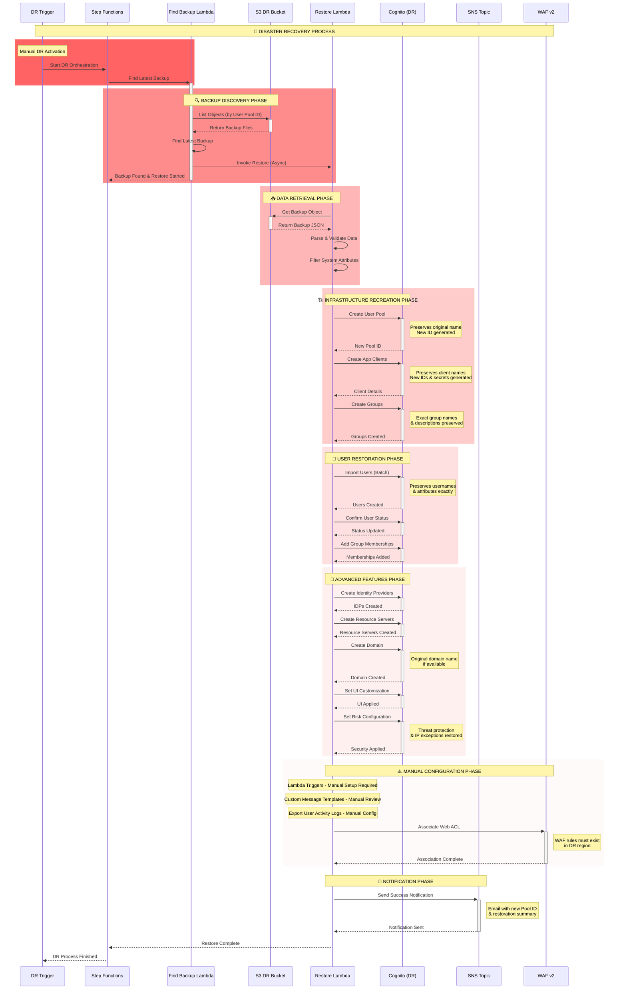

# Cognito DR Restore System

## ⚠️ Prerequisites
> **🚨 IMPORTANT**: This restore system works with backups created by the [primary backup system](https://github.com/demoq-demo/cognito/blob/main/cognito_backup_strategy.md).

## Overview
This document outlines the disaster recovery restore system for Amazon Cognito User Pools, showing what gets automatically restored vs. manual configuration required, and the complete restoration flow from S3 backups.

## 🔄 DR Restore Flow Sequence Diagram



## 📊 What Gets Automatically Restored

### 🟢 Fully Automated Restoration

| Component | Preservation Level | Details |
|-----------|-------------------|---------|
| **User Pool Name** | ✅ Exact Original | `kinesis-user-pool` → `kinesis-user-pool` |
| **Users & Attributes** | ✅ Exact Original | All custom/standard attributes preserved |
| **Usernames** | ✅ Exact Original | UUID or email format maintained |
| **User Status** | ✅ Exact Original | CONFIRMED/UNCONFIRMED preserved |
| **Groups** | ✅ Exact Original | Names, descriptions, precedence |
| **Group Memberships** | ✅ Exact Original | All user-group associations |
| **App Client Names** | ✅ Exact Original | Client names preserved exactly |
| **Pool Policies** | ✅ Exact Original | Password, MFA, verification rules |
| **Identity Providers** | ✅ Exact Original | SAML/OIDC configurations |
| **Resource Servers** | ✅ Exact Original | OAuth2 scopes and definitions |
| **Custom Domains** | ✅ Exact Original | Domain names if available |
| **UI Customization** | ✅ Exact Original | Branding, CSS, logos |
| **Threat Protection** | ✅ Exact Original | Advanced security + IP exceptions |

### 🔴 AWS-Generated (Cannot Be Preserved)

| Component | Why Auto-Generated | Impact |
|-----------|-------------------|--------|
| **User Pool ID** | Region-specific format | `us-east-1_Abc123` → `us-west-2_Def456` |
| **App Client ID** | Security requirement | New unique ID generated |
| **Client Secret** | Security requirement | New secret generated |
| **User `sub` ID** | Uniqueness guarantee | New UUID per user |

## 🏗️ DR Infrastructure Components

### Storage & Orchestration Architecture
```
DR Region (us-west-2)
├── 📦 S3 DR Bucket: cognito-backup-dr-prod-{account-id}
│   ├── 🔐 AES256 Encryption
│   ├── 📝 Versioning Enabled
│   ├── 🔄 Cross-region replicated data
│   └── 📁 Structure: cognito-backup/YYYY/MM/DD/
│
├── 🎭 Step Functions: cognito-dr-orchestration-prod
│   ├── 🔍 Find Latest Backup
│   ├── ⏳ Wait for Restore
│   └── ✅ Check Status
│
├── 🔧 Lambda Functions:
│   ├── 📋 Find Latest Backup (60s timeout)
│   ├── 🔄 Restore Lambda (15min timeout, 512MB)
│   └── 🚨 Manual DR Trigger
│
└── 📧 SNS Topic: cognito-dr-notifications-prod
    └── 📬 Email notifications
```

### Lambda Function Specifications

#### Find Latest Backup Lambda
- **Runtime**: Python 3.11
- **Timeout**: 60 seconds
- **Memory**: 128 MB (default)
- **Purpose**: Finds latest backup by timestamp
- **Engineer Notes**: 
  - Lists S3 objects with prefix `cognito-backup/`
  - Filters by user pool ID in object key
  - Sorts by `LastModified` timestamp to find most recent
  - Invokes Restore Lambda asynchronously with S3 key
  - Returns immediately to Step Functions (non-blocking)

#### Restore Lambda
- **Runtime**: Python 3.11
- **Timeout**: 15 minutes
- **Memory**: 512 MB
- **Purpose**: Full restoration of Cognito User Pool
- **Engineer Notes**:
  - Downloads backup JSON from S3 DR bucket
  - Parses and validates backup data structure
  - Filters out system attributes (`sub`, `email_verified`, etc.)
  - Creates user pool with preserved name and policies
  - Batch imports users (handles pagination for large datasets)
  - Recreates groups, clients, IDPs, resource servers
  - Applies UI customization and threat protection settings
  - Sends detailed success/failure notification via SNS

#### Manual DR Trigger Lambda
- **Runtime**: Python 3.11
- **Timeout**: 60 seconds
- **Memory**: 128 MB (default)
- **Purpose**: Initiates Step Functions orchestration
- **Engineer Notes**:
  - Accepts `user_pool_id` parameter from manual invocation
  - Starts Step Functions execution with unique name
  - Passes user pool ID to orchestration workflow
  - Returns execution ARN for tracking
  - Used for manual DR activation scenarios

## 🔧 Restoration Process Details

### Phase 1: Backup Discovery
1. **S3 Object Listing**: Search for backups matching user pool ID
2. **Latest Selection**: Choose most recent backup by timestamp
3. **Validation**: Verify backup file integrity and completeness

### Phase 2: Infrastructure Recreation
1. **User Pool Creation**: Recreate with original configuration
2. **Schema Preservation**: Maintain custom attributes and policies
3. **Client Recreation**: Generate new IDs but preserve settings
4. **Group Structure**: Recreate exact group hierarchy

### Phase 3: User Import Strategy
1. **Batch Processing**: Import users in optimized batches
2. **Attribute Filtering**: Remove system-generated attributes
3. **Status Preservation**: Maintain CONFIRMED/UNCONFIRMED states
4. **Group Assignment**: Restore all group memberships

### Phase 4: Advanced Features
1. **Identity Providers**: Recreate SAML/OIDC configurations
2. **Resource Servers**: Restore OAuth2 scopes and definitions
3. **Domain Setup**: Recreate custom domains if available
4. **Security Features**: Restore threat protection and IP exceptions

## 🚨 Manual Configuration Required

### 🔴 Critical Manual Steps (RTO Impact)

| Task | Reason | Estimated Time |
|------|--------|----------------|
| **Update App Configs** | New Pool/Client IDs | 15-30 minutes |
| **Update Okta/SAML** | New redirect URIs | 10-15 minutes |
| **Lambda Triggers** | Function dependencies | 20-30 minutes |
| **Custom Message Templates** | Sensitive data review | 10-20 minutes |
| **Export User Activity Logs** | CloudWatch integration | 15-25 minutes |
| **DNS Updates** | New domain endpoints | 5-60 minutes |
| **Deploy Changes** | Application deployment | 10-30 minutes |

### Application Configuration Updates

#### Web Applications
```javascript
// Update environment variables
const config = {
  COGNITO_USER_POOL_ID: 'us-west-2_YYYYYYYYY', // New DR pool ID
  COGNITO_CLIENT_ID: 'new_client_id',           // New client ID
  COGNITO_CLIENT_SECRET: 'new_secret',          // New secret
  AWS_REGION: 'us-west-2',                      // DR region
  COGNITO_DOMAIN: 'auth-dr.example.com'         // New domain
};
```

#### Amplify Applications
```javascript
// aws-exports.js updates
const awsmobile = {
    "aws_user_pools_id": "us-west-2_YYYYYYYYY",
    "aws_user_pools_web_client_id": "new_client_id",
    "aws_cognito_region": "us-west-2",
    "aws_user_pools_domain": "auth-dr.example.com"
};
```

#### Mobile Applications
```json
{
    "auth": {
        "plugins": {
            "awsCognitoAuthPlugin": {
                "UserPool": {
                    "Default": {
                        "PoolId": "us-west-2_YYYYYYYYY",
                        "AppClientId": "new_client_id",
                        "Region": "us-west-2"
                    }
                }
            }
        }
    }
}
```

### External Identity Provider Updates

#### Okta Configuration
```
Primary: https://cognito-idp.us-east-1.amazonaws.com/us-east-1_XXXXXXXXX/saml2/idpresponse
DR:      https://cognito-idp.us-west-2.amazonaws.com/us-west-2_YYYYYYYYY/saml2/idpresponse
```


**Why Manual Setup Required:**
- Lambda functions must exist in DR region
- Cross-region Lambda invocation not supported
- Function ARNs are region-specific
- Requires separate deployment pipeline


**Manual Review Checklist:**
- [ ] Remove environment-specific URLs
- [ ] Update contact information
- [ ] Verify compliance with data protection rules
- [ ] Test message delivery


## 📈 Restoration Metrics & Monitoring

### Performance Benchmarks estimate 
- **User Pool Creation**: ~2-5 minutes
- **User Import Rate**: ~1,000 users/minute
- **Group Creation**: ~30 seconds per group
- **Identity Providers**: ~1-2 minutes each
- **Domain Setup**: ~5-10 minutes

### Success Notification Example
```json
{
  "status": "SUCCESS",
  "new_user_pool_id": "us-west-2_YYYYYYYYY",
  "users_restored": 1247,
  "groups_restored": 5,
  "app_clients_restored": 3,
  "identity_providers_restored": 2,
  "resource_servers_restored": 1,
  "domain_restored": "Yes",
  "waf_restored": "Yes",
  "threat_protection_restored": "Yes",
  "ui_customization_restored": "Yes",
  "restore_duration": "8 minutes 32 seconds"
}
```

## 🔄 DR Activation Process

### Manual Trigger
```bash
# Invoke manual DR trigger Lambda
aws lambda invoke \
  --function-name cognito-manual-dr-trigger-prod \
  --payload '{"user_pool_id": "us-east-1_XXXXXXXXX"}' \
  response.json
```

### Step Functions Execution
1. **Find Latest Backup**: Locate most recent backup file
2. **Initiate Restore**: Start asynchronous restoration process
3. **Monitor Progress**: Track restoration status
4. **Send Notifications**: Email completion status

## 📋 Post-Restore Validation Checklist

### Immediate Validation
- [ ] User pool created with correct name
- [ ] User count matches backup
- [ ] Group memberships preserved
- [ ] App clients functional
- [ ] Identity providers working
- [ ] Custom domains accessible
- [ ] UI customizations applied
- [ ] Threat protection active

### Application Integration
- [ ] Update application configurations
- [ ] Test authentication flows
- [ ] Verify group-based permissions
- [ ] Test password reset functionality
- [ ] Validate MFA setup process

### User Communication
- [ ] Send password reset notifications
- [ ] Provide new authentication endpoints
- [ ] Update user documentation
- [ ] Test user support processes

## 🔐 Security Considerations

### Data Protection
- **Encryption**: All data encrypted at rest and in transit
- **Access Control**: IAM roles with least privilege
- **Audit Trail**: CloudTrail logging for all operations
- **Secret Management**: New secrets generated for security

### User Impact
- **Re-authentication Required**: Users must log in again
- **Password Reset**: All users must reset passwords
- **MFA Reconfiguration**: MFA devices must be re-registered
- **Session Invalidation**: All existing sessions terminated

## 🎯 RTO/RPO Targets

### Recovery Point Objective (RPO) Estimate
- **Target**: 1-2 hours maximum data loss
- **Factors**: Backup frequency, replication delay
- **Monitoring**: Backup success rates, replication lag

### Recovery Time Objective (RTO) Estimate
- **Target**: 2-4 hours for complete restoration
- **Breakdown**:
  - Infrastructure setup: 30 minutes
  - User restoration: 1-2 hours (depends on user count)
  - Application updates: 30-60 minutes
  - DNS propagation: 0-60 minutes

---
``` yaml

AWSTemplateFormatVersion: '2010-09-09'
Description: 'Cognito Restore Infrastructure - DR Region'

Parameters:
  Environment:
    Type: String
    Default: 'prod'
    Description: 'Environment name'
  
  PrimaryAccountId:
    Type: String
    Description: 'AWS Account ID of primary region'
  
  NotificationEmail:
    Type: String
    Description: 'Email address for DR notifications'

Resources:
  # S3 Bucket for replicated backups
  CognitoBackupDRBucket:
    Type: AWS::S3::Bucket
    Properties:
      BucketName: !Sub 'cognito-backup-dr-${Environment}-${AWS::AccountId}'
      VersioningConfiguration:
        Status: Enabled
      BucketEncryption:
        ServerSideEncryptionConfiguration:
          - ServerSideEncryptionByDefault:
              SSEAlgorithm: AES256
      LifecycleConfiguration:
        Rules:
          - Id: DeleteOldBackups
            Status: Enabled
            ExpirationInDays: 90

  # SNS Topic for DR notifications
  CognitoDRNotificationTopic:
    Type: AWS::SNS::Topic
    Properties:
      TopicName: !Sub 'cognito-dr-notifications-${Environment}'
      DisplayName: 'Cognito DR Notifications'
      Subscription:
        - Protocol: email
          Endpoint: !Ref NotificationEmail

  # Lambda execution role for restore
  CognitoRestoreLambdaRole:
    Type: AWS::IAM::Role
    Properties:
      AssumeRolePolicyDocument:
        Statement:
          - Effect: Allow
            Principal:
              Service: lambda.amazonaws.com
            Action: sts:AssumeRole
      ManagedPolicyArns:
        - arn:aws:iam::aws:policy/service-role/AWSLambdaBasicExecutionRole
      Policies:
        - PolicyName: CognitoRestorePolicy
          PolicyDocument:
            Statement:
              - Effect: Allow
                Action:
                  - cognito-idp:CreateUserPool
                  - cognito-idp:CreateUserPoolClient
                  - cognito-idp:CreateGroup
                  - cognito-idp:AdminCreateUser
                  - cognito-idp:AdminConfirmSignUp
                  - cognito-idp:AdminAddUserToGroup
                  - cognito-idp:CreateIdentityProvider
                  - cognito-idp:CreateResourceServer
                  - cognito-idp:CreateUserPoolDomain
                  - cognito-idp:SetUICustomization
                Resource: 'arn:aws:cognito-idp:*:*:userpool/*'
              - Effect: Allow
                Action:
                  - s3:GetObject
                Resource: !Sub '${CognitoBackupDRBucket.Arn}/*'
              - Effect: Allow
                Action:
                  - sns:Publish
                Resource: !Ref CognitoDRNotificationTopic
              - Effect: Allow
                Action:
                  - wafv2:AssociateWebACL
                  - wafv2:GetWebACL
                  - wafv2:ListWebACLs
                  - cognito-idp:SetRiskConfiguration
                  - cognito-idp:GetRiskConfiguration
                Resource: '*'

  # Lambda function for restore
  CognitoRestoreLambda:
    Type: AWS::Lambda::Function
    Properties:
      FunctionName: !Sub 'cognito-restore-${Environment}'
      Runtime: python3.11
      Handler: index.lambda_handler
      Role: !GetAtt CognitoRestoreLambdaRole.Arn
      Timeout: 900
      MemorySize: 512
      Environment:
        Variables:
          SOURCE_BUCKET: !Ref CognitoBackupDRBucket
          SNS_TOPIC_ARN: !Ref CognitoDRNotificationTopic
      Code:
        ZipFile: |
          import json
          import boto3
          import os
          import logging
          from datetime import datetime

          logger = logging.getLogger()
          logger.setLevel(logging.INFO)

          def lambda_handler(event, context):
              logger.info(f"Starting Cognito restore process. Event: {json.dumps(event)}")
              
              try:
                  cognito = boto3.client('cognito-idp')
                  s3 = boto3.client('s3')
                  sns = boto3.client('sns')
                  
                  source_bucket = os.environ['SOURCE_BUCKET']
                  sns_topic = os.environ['SNS_TOPIC_ARN']
                  logger.info(f"Using bucket: {source_bucket}, SNS topic: {sns_topic}")
                  
                  s3_key = event.get('s3_key')
                  if not s3_key:
                      logger.error("No S3 key provided for restore")
                      raise Exception('No S3 key provided for restore')
                  
                  logger.info(f"Downloading backup from S3 key: {s3_key}")
                  response = s3.get_object(Bucket=source_bucket, Key=s3_key)
                  backup_data = json.loads(response['Body'].read())
                  logger.info(f"Backup data loaded. Users: {len(backup_data.get('users', []))}, Groups: {len(backup_data.get('groups', []))}, Clients: {len(backup_data.get('app_clients', []))}")
                  
                  # Log what components are available in backup
                  logger.info("=== BACKUP COMPONENTS ANALYSIS ===")
                  logger.info(f"User Pool Domain: {'YES' if backup_data.get('user_pool_domain') else 'NO'}")
                  logger.info(f"UI Customization: {'YES' if backup_data.get('ui_customization') else 'NO'}")
                  logger.info(f"WAF Configuration: {'YES' if backup_data.get('waf_configuration') else 'NO'}")
                  logger.info(f"Risk Configuration: {'YES' if backup_data.get('risk_configuration') else 'NO'}")
                  logger.info(f"Identity Providers: {len(backup_data.get('identity_providers', []))}")
                  logger.info(f"Resource Servers: {len(backup_data.get('resource_servers', []))}")
                  
                  if backup_data.get('risk_configuration'):
                      risk_config = backup_data['risk_configuration']
                      logger.info(f"  - Compromised Credentials: {'YES' if risk_config.get('CompromisedCredentialsRiskConfiguration') else 'NO'}")
                      logger.info(f"  - Account Takeover (Auto Risk Response): {'YES' if risk_config.get('AccountTakeoverRiskConfiguration') else 'NO'}")
                      logger.info(f"  - IP Exceptions: {'YES' if risk_config.get('RiskExceptionConfiguration') else 'NO'}")
                      if risk_config.get('RiskExceptionConfiguration'):
                          risk_exceptions = risk_config['RiskExceptionConfiguration']
                          blocked_count = len(risk_exceptions.get('BlockedIPRangeList', []))
                          skipped_count = len(risk_exceptions.get('SkippedIPRangeList', []))
                          logger.info(f"    - Blocked IP Ranges: {blocked_count}")
                          logger.info(f"    - Skipped IP Ranges (Exceptions): {skipped_count}")
                  logger.info("=== END BACKUP ANALYSIS ===")
                  
                  user_pool_config = backup_data['user_pool_config'].copy()
                  logger.info(f"Original user pool name: {user_pool_config.get('Name', 'Unknown')}")
                  
                  # Map backup fields to API parameters first
                  if 'Name' in user_pool_config:
                      user_pool_config['PoolName'] = user_pool_config.pop('Name')
                  
                  # Remove read-only attributes and invalid parameters
                  invalid_attrs = [
                      'Id', 'Arn', 'CreationDate', 'LastModifiedDate', 'Status', 
                      'EstimatedNumberOfUsers', 'Domain', 'CustomDomain', 
                      'SmsConfigurationFailure', 'EmailConfigurationFailure',
                      'UserPoolTags', 'LambdaConfig'  # Remove Lambda triggers to prevent cross-region errors
                  ]
                  for attr in invalid_attrs:
                      user_pool_config.pop(attr, None)
                  
                  # Ensure PoolName exists
                  if 'PoolName' not in user_pool_config:
                      user_pool_config['PoolName'] = 'RestoredUserPool'
                  
                  # Preserve original username configuration as much as possible
                  if 'UsernameAttributes' in user_pool_config:
                      logger.info(f"Original username attributes: {user_pool_config['UsernameAttributes']}")
                      # Check if we have non-email usernames that would conflict
                      has_non_email_users = False
                      for user in backup_data.get('users', []):
                          if '@' not in user.get('Username', ''):
                              has_non_email_users = True
                              break
                      
                      # Only remove email restriction if we have UUID usernames
                      if has_non_email_users and user_pool_config['UsernameAttributes'] == ['email']:
                          logger.info("Removing email username restriction to accommodate UUID usernames")
                          user_pool_config.pop('UsernameAttributes')
                          # Also remove email from alias attributes if present
                          if 'AliasAttributes' in user_pool_config:
                              alias_attrs = user_pool_config['AliasAttributes']
                              if 'email' in alias_attrs:
                                  alias_attrs.remove('email')
                              if not alias_attrs:
                                  user_pool_config.pop('AliasAttributes')
                  
                  if 'SchemaAttributes' in user_pool_config:
                      schema = user_pool_config.pop('SchemaAttributes')
                      filtered_schema = []
                      for attr in schema:
                          attr_name = attr.get('Name', '')
                          if (len(attr_name) <= 20 and 
                              not attr_name.endswith('_verified') and
                              attr_name not in ['sub', 'email_verified', 'phone_number_verified']):
                              filtered_schema.append(attr)
                      user_pool_config['Schema'] = filtered_schema
                      logger.info(f"Filtered schema attributes: {len(filtered_schema)} kept from {len(schema)}")
                  
                  if 'AdminCreateUserConfig' in user_pool_config:
                      admin_config = user_pool_config['AdminCreateUserConfig']
                      if 'UnusedAccountValidityDays' in admin_config:
                          validity_days = admin_config.pop('UnusedAccountValidityDays')
                          if 'Policies' not in user_pool_config:
                              user_pool_config['Policies'] = {}
                          if 'PasswordPolicy' not in user_pool_config['Policies']:
                              user_pool_config['Policies']['PasswordPolicy'] = {}
                          user_pool_config['Policies']['PasswordPolicy']['TemporaryPasswordValidityDays'] = validity_days
                          logger.info(f"Moved UnusedAccountValidityDays to PasswordPolicy: {validity_days} days")
                  
                  logger.info("Creating user pool...")
                  new_pool = cognito.create_user_pool(**user_pool_config)
                  new_pool_id = new_pool['UserPool']['Id']
                  logger.info(f"Successfully created user pool: {new_pool_id}")
                  
                  # Create app clients
                  app_clients_created = 0
                  logger.info(f"Creating {len(backup_data.get('app_clients', []))} app clients...")
                  for client in backup_data.get('app_clients', []):
                      try:
                          client_config = client.copy()
                          client_name = client.get('ClientName', 'Unknown')
                          logger.info(f"Creating app client: {client_name}")
                          
                          # Remove read-only and invalid attributes
                          invalid_client_attrs = [
                              'ClientId', 'UserPoolId', 'CreationDate', 'LastModifiedDate',
                              'ReadAttributes', 'WriteAttributes'  # These cause validation errors
                          ]
                          for attr in invalid_client_attrs:
                              client_config.pop(attr, None)
                          
                          had_secret = 'ClientSecret' in client_config
                          if had_secret:
                              logger.info(f"Client '{client_name}' had secret - will generate new one")
                              client_config.pop('ClientSecret', None)
                              client_config['GenerateSecret'] = True
                          
                          response = cognito.create_user_pool_client(
                              UserPoolId=new_pool_id,
                              **client_config
                          )
                          
                          new_client = response['UserPoolClient']
                          logger.info(f"Created client: {new_client['ClientName']} | ID: {new_client['ClientId']}")
                          if 'ClientSecret' in new_client:
                              secret = new_client['ClientSecret']
                              logger.info(f"Generated secret for {new_client['ClientName']}: {secret[:8]}...{secret[-4:]}")
                          app_clients_created += 1
                      except Exception as e:
                          logger.error(f"Failed to create app client {client.get('ClientName', 'unknown')}: {str(e)}")
                  logger.info(f"Successfully created {app_clients_created} app clients")
                  
                  # Create groups
                  groups_created = 0
                  logger.info(f"Creating {len(backup_data.get('groups', []))} groups...")
                  for group in backup_data.get('groups', []):
                      try:
                          group_config = group.copy()
                          group_name = group.get('GroupName', 'unknown')
                          
                          # Remove invalid parameters for group creation
                          invalid_group_attrs = ['UserPoolId', 'CreationDate', 'LastModifiedDate']
                          for attr in invalid_group_attrs:
                              group_config.pop(attr, None)
                          
                          cognito.create_group(
                              UserPoolId=new_pool_id,
                              **group_config
                          )
                          logger.info(f"Created group: {group_name}")
                          groups_created += 1
                      except Exception as e:
                          logger.error(f"Failed to create group {group.get('GroupName', 'unknown')}: {str(e)}")
                  logger.info(f"Successfully created {groups_created} groups")
                  
                  # Import users
                  users_created = 0
                  logger.info(f"Creating {len(backup_data.get('users', []))} users...")
                  for user in backup_data.get('users', []):
                      try:
                          user_attrs = []
                          for attr in user.get('Attributes', []):
                              system_attrs = [
                                  'sub', 'email_verified', 'phone_number_verified',
                                  'cognito:username', 'cognito:mfa_enabled', 'identities',
                                  'user_create_date', 'user_last_modified_date'
                              ]
                              if attr['Name'] not in system_attrs:
                                  user_attrs.append({
                                      'Name': attr['Name'],
                                      'Value': attr['Value']
                                  })
                          
                          username = user['Username']
                          logger.info(f"Creating user: {username}")
                          
                          cognito.admin_create_user(
                              UserPoolId=new_pool_id,
                              Username=username,
                              UserAttributes=user_attrs,
                              MessageAction='SUPPRESS'
                          )
                          
                          if user.get('UserStatus') == 'CONFIRMED':
                              try:
                                  cognito.admin_confirm_sign_up(
                                      UserPoolId=new_pool_id,
                                      Username=username
                                  )
                                  logger.info(f"Confirmed user: {username}")
                              except Exception as e:
                                  logger.warning(f"Could not confirm user {username}: {str(e)}")
                          
                          users_created += 1
                      except Exception as e:
                          logger.error(f"Failed to create user {user.get('Username', 'unknown')}: {str(e)}")
                  logger.info(f"Successfully created {users_created} users")
                  
                  # Add users to groups
                  memberships_added = 0
                  group_memberships = backup_data.get('group_memberships', {})
                  logger.info(f"Adding group memberships for {len(group_memberships)} groups...")
                  for group_name, usernames in group_memberships.items():
                      for username in usernames:
                          try:
                              cognito.admin_add_user_to_group(
                                  UserPoolId=new_pool_id,
                                  Username=username,
                                  GroupName=group_name
                              )
                              memberships_added += 1
                          except Exception as e:
                              logger.error(f"Failed to add user {username} to group {group_name}: {str(e)}")
                  logger.info(f"Successfully added {memberships_added} group memberships")
                  
                  logger.info("=== RESTORATION SUMMARY ===")
                  logger.info(f"User Pool: {new_pool_id}")
                  logger.info(f"Users: {users_created}")
                  logger.info(f"Groups: {groups_created}")
                  logger.info(f"App Clients: {app_clients_created}")
                  logger.info(f"Group Memberships: {memberships_added}")
                  
                  # Create identity providers
                  idp_count = len(backup_data.get('identity_providers', []))
                  if idp_count > 0:
                      logger.info(f"Creating {idp_count} identity providers...")
                      for idp in backup_data.get('identity_providers', []):
                          idp_config = idp.copy()
                          for attr in ['UserPoolId', 'CreationDate', 'LastModifiedDate']:
                              idp_config.pop(attr, None)
                          try:
                              cognito.create_identity_provider(
                                  UserPoolId=new_pool_id,
                                  **idp_config
                              )
                              logger.info(f"Created identity provider: {idp.get('ProviderName', 'unknown')}")
                          except Exception as e:
                              logger.error(f"Failed to create identity provider: {str(e)}")
                  
                  # Create resource servers
                  rs_count = len(backup_data.get('resource_servers', []))
                  if rs_count > 0:
                      logger.info(f"Creating {rs_count} resource servers...")
                      for rs in backup_data.get('resource_servers', []):
                          rs_config = rs.copy()
                          rs_config.pop('UserPoolId', None)
                          try:
                              cognito.create_resource_server(
                                  UserPoolId=new_pool_id,
                                  **rs_config
                              )
                              logger.info(f"Created resource server: {rs.get('Name', 'unknown')}")
                          except Exception as e:
                              logger.error(f"Failed to create resource server: {str(e)}")
                  
                  # Restore user pool domain
                  logger.info("=== CHECKING DOMAIN RESTORATION ===")
                  if backup_data.get('user_pool_domain'):
                      logger.info("✓ Domain data found in backup - proceeding with restoration")
                      try:
                          domain_config = backup_data['user_pool_domain'].copy()
                          original_domain = backup_data['user_pool_domain'].get('Domain')
                          logger.info(f"Original domain: {original_domain}")
                          
                          for attr in ['Domain', 'UserPoolId', 'AWSAccountId', 'CloudFrontDistribution', 'Version', 'Status', 'CreationDate', 'LastModifiedDate', 'S3Bucket']:
                              domain_config.pop(attr, None)
                          domain_name = original_domain if original_domain else f"{new_pool_id}-dr"
                          
                          cognito.create_user_pool_domain(
                              Domain=domain_name,
                              UserPoolId=new_pool_id,
                              **domain_config
                          )
                          logger.info(f"✓ SUCCESS: Domain restored - {domain_name}")
                      except Exception as e:
                          logger.error(f"✗ FAILED: Domain restoration failed - {str(e)}")
                  else:
                      logger.info("✗ SKIPPED: No domain data found in backup")
                  
                  # Restore UI customization
                  logger.info("=== CHECKING UI CUSTOMIZATION RESTORATION ===")
                  if backup_data.get('ui_customization'):
                      logger.info("✓ UI customization data found in backup - proceeding with restoration")
                      try:
                          ui_config = backup_data['ui_customization'].copy()
                          for attr in ['UserPoolId', 'ClientId', 'CreationDate', 'LastModifiedDate']:
                              ui_config.pop(attr, None)
                          cognito.set_ui_customization(
                              UserPoolId=new_pool_id,
                              **ui_config
                          )
                          logger.info("✓ SUCCESS: UI customization restored")
                      except Exception as e:
                          logger.error(f"✗ FAILED: UI customization restoration failed - {str(e)}")
                  else:
                      logger.info("✗ SKIPPED: No UI customization data found in backup")
                  
                  # Restore WAF configuration
                  logger.info("=== CHECKING WAF CONFIGURATION RESTORATION ===")
                  if backup_data.get('waf_configuration'):
                      waf_config = backup_data['waf_configuration']
                      logger.info(f"✓ WAF configuration found in backup - WebACL: {waf_config.get('WebACLName', 'Unknown')}")
                      try:
                          wafv2 = boto3.client('wafv2')
                          user_pool_arn = f"arn:aws:cognito-idp:{boto3.Session().region_name}:{boto3.client('sts').get_caller_identity()['Account']}:userpool/{new_pool_id}"
                          
                          wafv2.associate_web_acl(
                              WebACLArn=waf_config['WebACLArn'],
                              ResourceArn=user_pool_arn
                          )
                          logger.info(f"✓ SUCCESS: WAF associated - {waf_config['WebACLName']}")
                      except Exception as e:
                          logger.error(f"✗ FAILED: WAF configuration restoration failed - {str(e)}")
                  else:
                      logger.info("✗ SKIPPED: No WAF configuration found in backup")
                  
                  # Restore risk configuration (threat protection with IP exceptions)
                  logger.info("=== CHECKING THREAT PROTECTION RESTORATION ===")
                  if backup_data.get('risk_configuration'):
                      logger.info("✓ Risk configuration data found in backup - proceeding with restoration")
                      try:
                          risk_config = backup_data['risk_configuration']
                          filtered_risk_config = {}
                          
                          # Compromised credentials
                          if risk_config.get('CompromisedCredentialsRiskConfiguration'):
                              filtered_risk_config['CompromisedCredentialsRiskConfiguration'] = risk_config['CompromisedCredentialsRiskConfiguration']
                              logger.info("✓ Compromised credentials risk configuration added")
                          else:
                              logger.info("✗ No compromised credentials configuration in backup")
                          
                          # Account takeover (automatic risk response)
                          if risk_config.get('AccountTakeoverRiskConfiguration'):
                              filtered_risk_config['AccountTakeoverRiskConfiguration'] = risk_config['AccountTakeoverRiskConfiguration']
                              logger.info("✓ SUCCESS: Account takeover risk configuration added (AUTOMATIC RISK RESPONSE)")
                          else:
                              logger.info("✗ No account takeover configuration in backup")
                          
                          # IP exceptions
                          if risk_config.get('RiskExceptionConfiguration'):
                              risk_exceptions = risk_config['RiskExceptionConfiguration']
                              filtered_risk_config['RiskExceptionConfiguration'] = risk_exceptions
                              logger.info("✓ IP exception configuration added")
                              
                              if risk_exceptions.get('BlockedIPRangeList'):
                                  blocked_ips = risk_exceptions['BlockedIPRangeList']
                                  logger.info(f"✓ SUCCESS: Restored {len(blocked_ips)} blocked IP ranges: {blocked_ips}")
                              else:
                                  logger.info("- No blocked IP ranges in backup")
                              
                              if risk_exceptions.get('SkippedIPRangeList'):
                                  skipped_ips = risk_exceptions['SkippedIPRangeList']
                                  logger.info(f"✓ SUCCESS: Restored {len(skipped_ips)} skipped IP ranges (EXCEPTIONS): {skipped_ips}")
                              else:
                                  logger.info("- No skipped IP ranges in backup")
                          else:
                              logger.info("✗ No IP exception configuration in backup")
                          
                          if filtered_risk_config:
                              cognito.set_risk_configuration(
                                  UserPoolId=new_pool_id,
                                  **filtered_risk_config
                              )
                              logger.info("✓ SUCCESS: Threat protection configuration with IP exceptions FULLY RESTORED")
                          else:
                              logger.info("✗ No valid risk configuration to restore")
                      except Exception as e:
                          logger.error(f"✗ FAILED: Risk configuration restoration failed - {str(e)}")
                  else:
                      logger.info("✗ SKIPPED: No risk configuration data found in backup")
                  
                  # Send success notification
                  logger.info("Sending success notification...")
                  sns.publish(
                      TopicArn=sns_topic,
                      Message=json.dumps({
                          'status': 'SUCCESS',
                          'new_user_pool_id': new_pool_id,
                          'users_restored': users_created,
                          'groups_restored': groups_created,
                          'app_clients_restored': app_clients_created,
                          'identity_providers_restored': len(backup_data.get('identity_providers', [])),
                          'resource_servers_restored': len(backup_data.get('resource_servers', [])),
                          'domain_restored': 'Yes' if backup_data.get('user_pool_domain') else 'No',
                          'waf_restored': 'Yes' if backup_data.get('waf_configuration') else 'No',
                          'threat_protection_restored': 'Yes' if backup_data.get('risk_configuration') else 'No',
                          'ui_customization_restored': 'Yes' if backup_data.get('ui_customization') else 'No'
                      }),
                      Subject='Cognito DR Restore Completed'
                  )
                  
                  logger.info(f"Restore completed successfully. New user pool ID: {new_pool_id}")
                  return {
                      'statusCode': 200,
                      'body': json.dumps({
                          'message': 'Restore completed successfully',
                          'new_user_pool_id': new_pool_id
                      })
                  }
                  
              except Exception as e:
                  logger.error(f"Restore failed with error: {str(e)}", exc_info=True)
                  
                  try:
                      sns = boto3.client('sns')
                      sns.publish(
                          TopicArn=os.environ['SNS_TOPIC_ARN'],
                          Message=json.dumps({
                              'status': 'FAILED',
                              'error': str(e),
                              'timestamp': datetime.utcnow().isoformat()
                          }),
                          Subject='Cognito DR Restore Failed'
                      )
                      logger.info("Failure notification sent")
                  except Exception as notify_error:
                      logger.error(f"Failed to send failure notification: {str(notify_error)}")
                  
                  return {
                      'statusCode': 500,
                      'body': json.dumps({'error': str(e)})
                  }

  # Lambda function to find latest backup
  FindLatestBackupLambda:
    Type: AWS::Lambda::Function
    Properties:
      FunctionName: !Sub 'cognito-find-latest-backup-${Environment}'
      Runtime: python3.11
      Handler: index.lambda_handler
      Role: !GetAtt FindLatestBackupRole.Arn
      Timeout: 60
      Environment:
        Variables:
          SOURCE_BUCKET: !Ref CognitoBackupDRBucket
          RESTORE_LAMBDA_ARN: !GetAtt CognitoRestoreLambda.Arn
      Code:
        ZipFile: |
          import json
          import boto3
          import os
          from datetime import datetime

          def lambda_handler(event, context):
              try:
                  s3 = boto3.client('s3')
                  lambda_client = boto3.client('lambda')
                  
                  bucket = os.environ['SOURCE_BUCKET']
                  restore_lambda_arn = os.environ['RESTORE_LAMBDA_ARN']
                  
                  user_pool_id = event.get('user_pool_id')
                  if not user_pool_id:
                      raise Exception('No user_pool_id provided')
                  
                  prefix = f"cognito-backup/"
                  response = s3.list_objects_v2(
                      Bucket=bucket,
                      Prefix=prefix
                  )
                  
                  latest_backup = None
                  latest_date = None
                  
                  for obj in response.get('Contents', []):
                      if user_pool_id in obj['Key']:
                          if latest_date is None or obj['LastModified'] > latest_date:
                              latest_date = obj['LastModified']
                              latest_backup = obj['Key']
                  
                  if not latest_backup:
                      raise Exception(f'No backup found for user pool {user_pool_id}')
                  
                  lambda_client.invoke(
                      FunctionName=restore_lambda_arn,
                      InvocationType='Event',
                      Payload=json.dumps({
                          's3_key': latest_backup,
                          'user_pool_id': user_pool_id
                      })
                  )
                  
                  return {
                      'statusCode': 200,
                      'body': json.dumps({
                          'message': f'Restore initiated for {user_pool_id}',
                          'backup_file': latest_backup
                      })
                  }
                  
              except Exception as e:
                  print(f"Find backup failed: {str(e)}")
                  return {
                      'statusCode': 500,
                      'body': json.dumps({'error': str(e)})
                  }

  # Role for find latest backup Lambda
  FindLatestBackupRole:
    Type: AWS::IAM::Role
    Properties:
      AssumeRolePolicyDocument:
        Statement:
          - Effect: Allow
            Principal:
              Service: lambda.amazonaws.com
            Action: sts:AssumeRole
      ManagedPolicyArns:
        - arn:aws:iam::aws:policy/service-role/AWSLambdaBasicExecutionRole
      Policies:
        - PolicyName: FindBackupPolicy
          PolicyDocument:
            Statement:
              - Effect: Allow
                Action:
                  - s3:ListBucket
                Resource: !GetAtt CognitoBackupDRBucket.Arn
              - Effect: Allow
                Action:
                  - lambda:InvokeFunction
                Resource: !GetAtt CognitoRestoreLambda.Arn

  # Step Functions state machine for DR orchestration
  CognitoDRStateMachine:
    Type: AWS::StepFunctions::StateMachine
    Properties:
      StateMachineName: !Sub 'cognito-dr-orchestration-${Environment}'
      RoleArn: !GetAtt StepFunctionsRole.Arn
      DefinitionString: !Sub |
        {
          "Comment": "Cognito DR Orchestration",
          "StartAt": "FindLatestBackup",
          "States": {
            "FindLatestBackup": {
              "Type": "Task",
              "Resource": "${FindLatestBackupLambda.Arn}",
              "Next": "WaitForRestore",
              "Retry": [
                {
                  "ErrorEquals": ["States.TaskFailed"],
                  "IntervalSeconds": 30,
                  "MaxAttempts": 3
                }
              ]
            },
            "WaitForRestore": {
              "Type": "Wait",
              "Seconds": 60,
              "Next": "CheckRestoreStatus"
            },
            "CheckRestoreStatus": {
              "Type": "Succeed"
            }
          }
        }

  # Role for Step Functions
  StepFunctionsRole:
    Type: AWS::IAM::Role
    Properties:
      AssumeRolePolicyDocument:
        Statement:
          - Effect: Allow
            Principal:
              Service: states.amazonaws.com
            Action: sts:AssumeRole
      Policies:
        - PolicyName: StepFunctionsPolicy
          PolicyDocument:
            Statement:
              - Effect: Allow
                Action:
                  - lambda:InvokeFunction
                Resource: 
                  - !GetAtt FindLatestBackupLambda.Arn
                  - !GetAtt CognitoRestoreLambda.Arn

  # Manual DR trigger Lambda
  ManualDRTriggerLambda:
    Type: AWS::Lambda::Function
    Properties:
      FunctionName: !Sub 'cognito-manual-dr-trigger-${Environment}'
      Runtime: python3.11
      Handler: index.lambda_handler
      Role: !GetAtt ManualDRTriggerRole.Arn
      Timeout: 60
      Environment:
        Variables:
          STATE_MACHINE_ARN: !Ref CognitoDRStateMachine
      Code:
        ZipFile: |
          import json
          import boto3
          import os
          import time
          
          def lambda_handler(event, context):
              try:
                  stepfunctions = boto3.client('stepfunctions')
                  
                  user_pool_id = event.get('user_pool_id')
                  if not user_pool_id:
                      return {
                          'statusCode': 400,
                          'body': json.dumps({'error': 'user_pool_id required'})
                      }
                  
                  response = stepfunctions.start_execution(
                      stateMachineArn=os.environ['STATE_MACHINE_ARN'],
                      name=f'dr-restore-{user_pool_id}-{int(time.time())}',
                      input=json.dumps({'user_pool_id': user_pool_id})
                  )
                  
                  return {
                      'statusCode': 200,
                      'body': json.dumps({
                          'message': f'DR restore initiated for {user_pool_id}',
                          'execution_arn': response['executionArn']
                      })
                  }
                  
              except Exception as e:
                  return {
                      'statusCode': 500,
                      'body': json.dumps({'error': str(e)})
                  }

  # Role for manual DR trigger
  ManualDRTriggerRole:
    Type: AWS::IAM::Role
    Properties:
      AssumeRolePolicyDocument:
        Statement:
          - Effect: Allow
            Principal:
              Service: lambda.amazonaws.com
            Action: sts:AssumeRole
      ManagedPolicyArns:
        - arn:aws:iam::aws:policy/service-role/AWSLambdaBasicExecutionRole
      Policies:
        - PolicyName: ManualDRTriggerPolicy
          PolicyDocument:
            Statement:
              - Effect: Allow
                Action:
                  - states:StartExecution
                Resource: !Ref CognitoDRStateMachine

Outputs:
  RestoreLambdaArn:
    Description: 'ARN of restore Lambda function'
    Value: !GetAtt CognitoRestoreLambda.Arn
    Export:
      Name: !Sub '${AWS::StackName}-RestoreLambdaArn'
  
  DRBucketName:
    Description: 'S3 bucket for DR backups'
    Value: !Ref CognitoBackupDRBucket
    Export:
      Name: !Sub '${AWS::StackName}-DRBucket'
  
  DRBucketArn:
    Description: 'ARN of DR bucket for replication setup'
    Value: !GetAtt CognitoBackupDRBucket.Arn
    Export:
      Name: !Sub '${AWS::StackName}-DRBucketArn'
  
  NotificationTopicArn:
    Description: 'SNS topic for DR notifications'
    Value: !Ref CognitoDRNotificationTopic
    Export:
      Name: !Sub '${AWS::StackName}-NotificationTopic'
  
  StateMachineArn:
    Description: 'Step Functions state machine for DR orchestration'
    Value: !Ref CognitoDRStateMachine
    Export:
      Name: !Sub '${AWS::StackName}-StateMachine'
  
  ManualDRTriggerArn:
    Description: 'Lambda function to manually trigger DR'
    Value: !GetAtt ManualDRTriggerLambda.Arn
    Export:
      Name: !Sub '${AWS::StackName}-ManualDRTrigger'

```
