# Cognito DR Restore System

## ⚠️ Prerequisites
> **🚨 IMPORTANT**: This restore system works with backups created by the [primary backup system](https://github.com/demoq-demo/cognito/blob/main/cognito_primary_backup.md). Deploy the backup infrastructure first.

## Overview
This document outlines the disaster recovery restore system for Amazon Cognito User Pools, showing what gets automatically restored vs. manual configuration required, and the complete restoration flow from S3 backups.

## 🔄 DR Restore Flow Sequence Diagram

```mermaid
sequenceDiagram
    participant T as DR Trigger
    participant SF as Step Functions
    participant FL as Find Backup Lambda
    participant S3DR as S3 DR Bucket
    participant RL as Restore Lambda
    participant C as Cognito (DR)
    participant SNS as SNS Topic
    participant WAF as WAF v2
    
    Note over T,WAF: 🔴 DISASTER RECOVERY PROCESS
    
    rect rgb(255, 99, 99)
        Note over T: Manual DR Activation
        T->>+SF: Start DR Orchestration
        SF->>+FL: Find Latest Backup
    end
    
    rect rgb(255, 140, 140)
        Note over FL,S3DR: 🔍 BACKUP DISCOVERY PHASE
        FL->>+S3DR: List Objects (by User Pool ID)
        S3DR-->>-FL: Return Backup Files
        FL->>FL: Find Latest Backup
        FL->>+RL: Invoke Restore (Async)
        FL-->>-SF: Backup Found & Restore Started
    end
    
    rect rgb(255, 182, 182)
        Note over RL,S3DR: 📥 DATA RETRIEVAL PHASE
        RL->>+S3DR: Get Backup Object
        S3DR-->>-RL: Return Backup JSON
        RL->>RL: Parse & Validate Data
        RL->>RL: Filter System Attributes
    end
    
    rect rgb(255, 204, 204)
        Note over RL,C: 🏗️ INFRASTRUCTURE RECREATION PHASE
        RL->>+C: Create User Pool
        Note right of C: Preserves original name<br/>New ID generated
        C-->>-RL: New Pool ID
        
        RL->>+C: Create App Clients
        Note right of C: Preserves client names<br/>New IDs & secrets generated
        C-->>-RL: Client Details
        
        RL->>+C: Create Groups
        Note right of C: Exact group names<br/>& descriptions preserved
        C-->>-RL: Groups Created
    end
    
    rect rgb(255, 224, 224)
        Note over RL,C: 👥 USER RESTORATION PHASE
        RL->>+C: Import Users (Batch)
        Note right of C: Preserves usernames<br/>& attributes exactly
        C-->>-RL: Users Created
        
        RL->>+C: Confirm User Status
        C-->>-RL: Status Updated
        
        RL->>+C: Add Group Memberships
        C-->>-RL: Memberships Added
    end
    
    rect rgb(255, 240, 240)
        Note over RL,C: 🔧 ADVANCED FEATURES PHASE
        RL->>+C: Create Identity Providers
        C-->>-RL: IDPs Created
        
        RL->>+C: Create Resource Servers
        C-->>-RL: Resource Servers Created
        
        RL->>+C: Create Domain
        Note right of C: Original domain name<br/>if available
        C-->>-RL: Domain Created
        
        RL->>+C: Set UI Customization
        C-->>-RL: UI Applied
        
        RL->>+C: Set Risk Configuration
        Note right of C: Threat protection<br/>& IP exceptions restored
        C-->>-RL: Security Applied
    end
    
    rect rgb(255, 250, 250)
        Note over RL,WAF: ⚠️ MANUAL CONFIGURATION PHASE
        RL->>+WAF: Associate Web ACL
        Note right of WAF: WAF rules must exist<br/>in DR region
        WAF-->>-RL: Association Complete
    end
    
    rect rgb(255, 255, 255)
        Note over RL,SNS: 📧 NOTIFICATION PHASE
        RL->>+SNS: Send Success Notification
        Note right of SNS: Email with new Pool ID<br/>& restoration summary
        SNS-->>-RL: Notification Sent
    end
    
    RL-->>SF: Restore Complete
    SF-->>T: DR Process Finished
```



## 📊 What Gets Automatically Restored

### 🟢 Fully Automated Restoration

| Component | Preservation Level | Details |
|-----------|-------------------|---------|
| **User Pool Name** | ✅ Exact Original | `kinesis-user-pool` → `kinesis-user-pool` |
| **Users & Attributes** | ✅ Exact Original | All custom/standard attributes preserved |
| **Usernames** | ✅ Exact Original | UUID or email format maintained |
| **User Status** | ✅ Exact Original | CONFIRMED/UNCONFIRMED preserved |
| **Groups** | ✅ Exact Original | Names, descriptions, precedence |
| **Group Memberships** | ✅ Exact Original | All user-group associations |
| **App Client Names** | ✅ Exact Original | Client names preserved exactly |
| **Pool Policies** | ✅ Exact Original | Password, MFA, verification rules |
| **Identity Providers** | ✅ Exact Original | SAML/OIDC configurations |
| **Resource Servers** | ✅ Exact Original | OAuth2 scopes and definitions |
| **Custom Domains** | ✅ Exact Original | Domain names if available |
| **UI Customization** | ✅ Exact Original | Branding, CSS, logos |
| **Threat Protection** | ✅ Exact Original | Advanced security + IP exceptions |

### 🔴 AWS-Generated (Cannot Be Preserved)

| Component | Why Auto-Generated | Impact |
|-----------|-------------------|--------|
| **User Pool ID** | Region-specific format | `us-east-1_Abc123` → `us-west-2_Def456` |
| **App Client ID** | Security requirement | New unique ID generated |
| **Client Secret** | Security requirement | New secret generated |
| **User `sub` ID** | Uniqueness guarantee | New UUID per user |

## 🏗️ DR Infrastructure Components

### Storage & Orchestration Architecture
```
DR Region (us-west-2)
├── 📦 S3 DR Bucket: cognito-backup-dr-prod-{account-id}
│   ├── 🔐 AES256 Encryption
│   ├── 📝 Versioning Enabled
│   ├── 🔄 Cross-region replicated data
│   └── 📁 Structure: cognito-backup/YYYY/MM/DD/
│
├── 🎭 Step Functions: cognito-dr-orchestration-prod
│   ├── 🔍 Find Latest Backup
│   ├── ⏳ Wait for Restore
│   └── ✅ Check Status
│
├── 🔧 Lambda Functions:
│   ├── 📋 Find Latest Backup (60s timeout)
│   ├── 🔄 Restore Lambda (15min timeout, 512MB)
│   └── 🚨 Manual DR Trigger
│
└── 📧 SNS Topic: cognito-dr-notifications-prod
    └── 📬 Email notifications
```

### Lambda Function Specifications
- **Find Backup**: Python 3.11, 60s timeout, finds latest backup by timestamp
- **Restore**: Python 3.11, 15min timeout, 512MB memory, full restoration
- **Manual Trigger**: Python 3.11, 60s timeout, initiates Step Functions

## 🔧 Restoration Process Details

### Phase 1: Backup Discovery
1. **S3 Object Listing**: Search for backups matching user pool ID
2. **Latest Selection**: Choose most recent backup by timestamp
3. **Validation**: Verify backup file integrity and completeness

### Phase 2: Infrastructure Recreation
1. **User Pool Creation**: Recreate with original configuration
2. **Schema Preservation**: Maintain custom attributes and policies
3. **Client Recreation**: Generate new IDs but preserve settings
4. **Group Structure**: Recreate exact group hierarchy

### Phase 3: User Import Strategy
1. **Batch Processing**: Import users in optimized batches
2. **Attribute Filtering**: Remove system-generated attributes
3. **Status Preservation**: Maintain CONFIRMED/UNCONFIRMED states
4. **Group Assignment**: Restore all group memberships

### Phase 4: Advanced Features
1. **Identity Providers**: Recreate SAML/OIDC configurations
2. **Resource Servers**: Restore OAuth2 scopes and definitions
3. **Domain Setup**: Recreate custom domains if available
4. **Security Features**: Restore threat protection and IP exceptions

## 🚨 Manual Configuration Required

### 🔴 Critical Manual Steps (RTO Impact)

| Task | Reason | Estimated Time |
|------|--------|----------------|
| **Update App Configs** | New Pool/Client IDs | 15-30 minutes |
| **Update Okta/SAML** | New redirect URIs | 10-15 minutes |
| **DNS Updates** | New domain endpoints | 5-60 minutes |
| **Deploy Changes** | Application deployment | 10-30 minutes |

### Application Configuration Updates

#### Web Applications
```javascript
// Update environment variables
const config = {
  COGNITO_USER_POOL_ID: 'us-west-2_YYYYYYYYY', // New DR pool ID
  COGNITO_CLIENT_ID: 'new_client_id',           // New client ID
  COGNITO_CLIENT_SECRET: 'new_secret',          // New secret
  AWS_REGION: 'us-west-2',                      // DR region
  COGNITO_DOMAIN: 'auth-dr.example.com'         // New domain
};
```

#### Amplify Applications
```javascript
// aws-exports.js updates
const awsmobile = {
    "aws_user_pools_id": "us-west-2_YYYYYYYYY",
    "aws_user_pools_web_client_id": "new_client_id",
    "aws_cognito_region": "us-west-2",
    "aws_user_pools_domain": "auth-dr.example.com"
};
```

#### Mobile Applications
```json
{
    "auth": {
        "plugins": {
            "awsCognitoAuthPlugin": {
                "UserPool": {
                    "Default": {
                        "PoolId": "us-west-2_YYYYYYYYY",
                        "AppClientId": "new_client_id",
                        "Region": "us-west-2"
                    }
                }
            }
        }
    }
}
```

### External Identity Provider Updates

#### Okta Configuration
```
Primary: https://cognito-idp.us-east-1.amazonaws.com/us-east-1_XXXXXXXXX/saml2/idpresponse
DR:      https://cognito-idp.us-west-2.amazonaws.com/us-west-2_YYYYYYYYY/saml2/idpresponse
```

## 📈 Restoration Metrics & Monitoring

### Performance Benchmarks
- **User Pool Creation**: ~2-5 minutes
- **User Import Rate**: ~1,000 users/minute
- **Group Creation**: ~30 seconds per group
- **Identity Providers**: ~1-2 minutes each
- **Domain Setup**: ~5-10 minutes

### Success Notification Example
```json
{
  "status": "SUCCESS",
  "new_user_pool_id": "us-west-2_YYYYYYYYY",
  "users_restored": 1247,
  "groups_restored": 5,
  "app_clients_restored": 3,
  "identity_providers_restored": 2,
  "resource_servers_restored": 1,
  "domain_restored": "Yes",
  "waf_restored": "Yes",
  "threat_protection_restored": "Yes",
  "ui_customization_restored": "Yes",
  "restore_duration": "8 minutes 32 seconds"
}
```

## 🔄 DR Activation Process

### Manual Trigger
```bash
# Invoke manual DR trigger Lambda
aws lambda invoke \
  --function-name cognito-manual-dr-trigger-prod \
  --payload '{"user_pool_id": "us-east-1_XXXXXXXXX"}' \
  response.json
```

### Step Functions Execution
1. **Find Latest Backup**: Locate most recent backup file
2. **Initiate Restore**: Start asynchronous restoration process
3. **Monitor Progress**: Track restoration status
4. **Send Notifications**: Email completion status

## 📋 Post-Restore Validation Checklist

### Immediate Validation
- [ ] User pool created with correct name
- [ ] User count matches backup
- [ ] Group memberships preserved
- [ ] App clients functional
- [ ] Identity providers working
- [ ] Custom domains accessible
- [ ] UI customizations applied
- [ ] Threat protection active

### Application Integration
- [ ] Update application configurations
- [ ] Test authentication flows
- [ ] Verify group-based permissions
- [ ] Test password reset functionality
- [ ] Validate MFA setup process

### User Communication
- [ ] Send password reset notifications
- [ ] Provide new authentication endpoints
- [ ] Update user documentation
- [ ] Test user support processes

## 🔐 Security Considerations

### Data Protection
- **Encryption**: All data encrypted at rest and in transit
- **Access Control**: IAM roles with least privilege
- **Audit Trail**: CloudTrail logging for all operations
- **Secret Management**: New secrets generated for security

### User Impact
- **Re-authentication Required**: Users must log in again
- **Password Reset**: All users must reset passwords
- **MFA Reconfiguration**: MFA devices must be re-registered
- **Session Invalidation**: All existing sessions terminated

## 🎯 RTO/RPO Targets

### Recovery Point Objective (RPO)
- **Target**: 1-2 hours maximum data loss
- **Factors**: Backup frequency, replication delay
- **Monitoring**: Backup success rates, replication lag

### Recovery Time Objective (RTO)
- **Target**: 2-4 hours for complete restoration
- **Breakdown**:
  - Infrastructure setup: 30 minutes
  - User restoration: 1-2 hours (depends on user count)
  - Application updates: 30-60 minutes
  - DNS propagation: 0-60 minutes

---

*Last Updated: $(Get-Date -Format "yyyy-MM-dd HH:mm:ss")*
